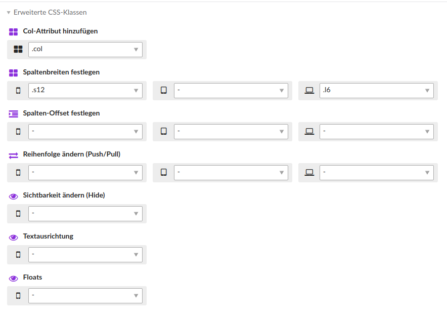
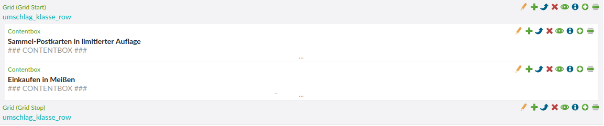

# Andere Erweiterungen

Folgende Erweiterungen werden vom Mate Theme genutzt:

## Contao Advanced Classes

Das Modul erweitert die CSS-Klassen der Contao Elemente durch selbst definierbare Sets an CSS-Klassen. Redakteure und Admins können über Select-Felder schnell auf vordefinierte CSS-Klassen zugreifen. Die Klassen kann man bei einem Inhaltselement unter **Erweiterte CSS-Klassen** setzen \(siehe Bild 1\).

## Contao Bootstrap Grid

Das Bootstrap Grid Modul wurde lediglich dafür verwendet um mehrere Elemente, die nebeneinander dargestellt werden sollen, in einem **DIV** mit der Klasse **row** zusammenzufassen \(siehe Bild 2\). Dafür wurde unter **Themes** und **Manage grid definitions** \(das vorletzte Icon\) ein leeres Grid-Element angelegt.

## Contao SEO Serp Preview

Mit **Contao SEO Serp Preview** sieht man in einer Seite wie die Seite in den Google-Suchergebnissen ausschauen würde. Außerdem kann man in der Seitenstruktur über den Button **Enable SERP** anzeigen lassen wo noch ein Seitentitel oder eine Seitenbeschreibung fehlt.
