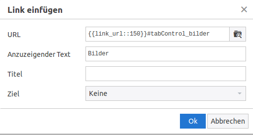
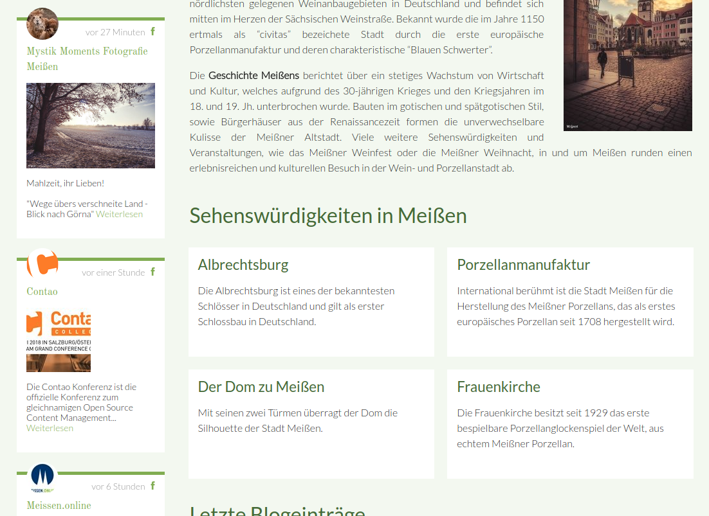
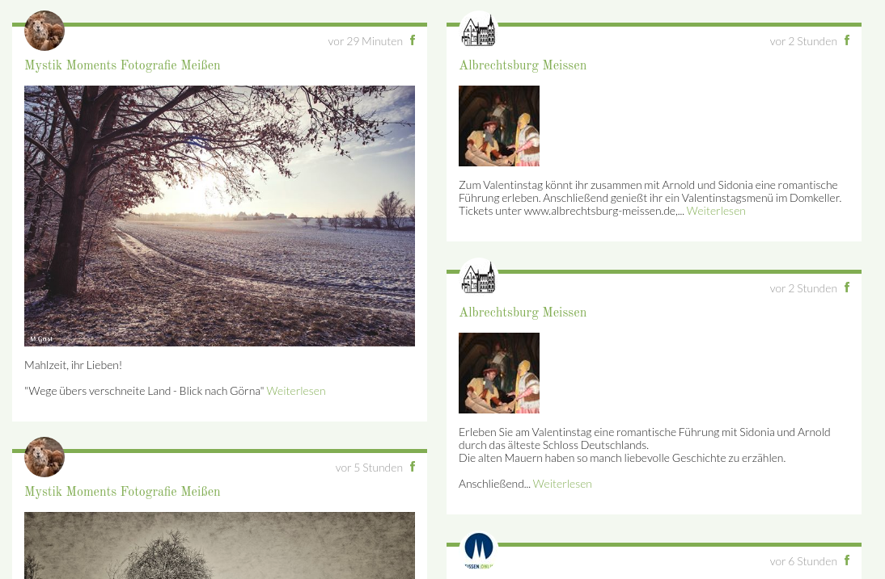
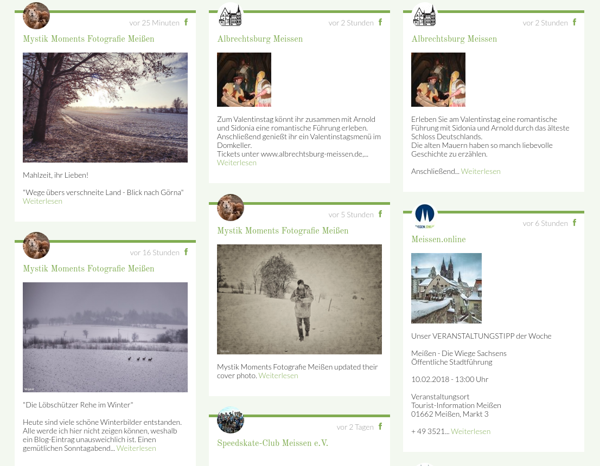

# Andere Erweiterungen

## Tabcontrol

Wenn die [Tabcontrol](https://christianbarkowsky.de/tabcontrol-contao.html)-Erweiterung von Christian Barkowsky eingesetzt wird und zu einem Tab verlinkt werden soll, kann man dies über Anker lösen. z. B. _www.example.org/page.html\#tabControl\_tabname_. Wichtig ist, dass die ID immer mit **tabControl\_** beginnt, ansonsten versucht das MATE Theme zum Anker auf der gleichen Seite zu scrollen. Zudem muss im Panel die entsprechende ID vergeben werden.

## Google Maps

Wenn Sie eine Google Maps Karte einbinden möchten, installieren Sie über den Contao Manager das Paket **delahaye/dlh\_googlemaps**.

Auf der Kontakt-Seite ist neben dem Kontakt-Formular ein Platzhalter-Bild platziert, wo beispielsweise eine Google Maps Karte eingebunden werden könnte. Soll die Karte an dieser Stelle angezeigt werden, vergeben Sie dem Element noch die Klassen **col s12 m5**.

## Social Feed Bundle

Mit der Social Feed Bundle können Sie Beiträge von Facebook \(demnächst auch mehr wie Instagram, Twitter, etc.\) im Mate Theme anzeigen lassen. Installieren Sie dafür einfach über den Contao Manager das Paket mit dem Namen **pdir/social-feed-bundle**.

Eine Anleitung wie Sie den Facebook-Stream einrichten, finden Sie auf folgender Seite: [https://docs.pdir.de/social-feed/einrichtung-facebook-stream.html](https://docs.pdir.de/social-feed/einrichtung-facebook-stream.html).

**Einspaltiger Social Media Stream \(beispielhafte Einbindung in linker Spalte\)**

**Zweispaltiger Social Media Stream**

**Dreispaltiger Social Media Stream**

