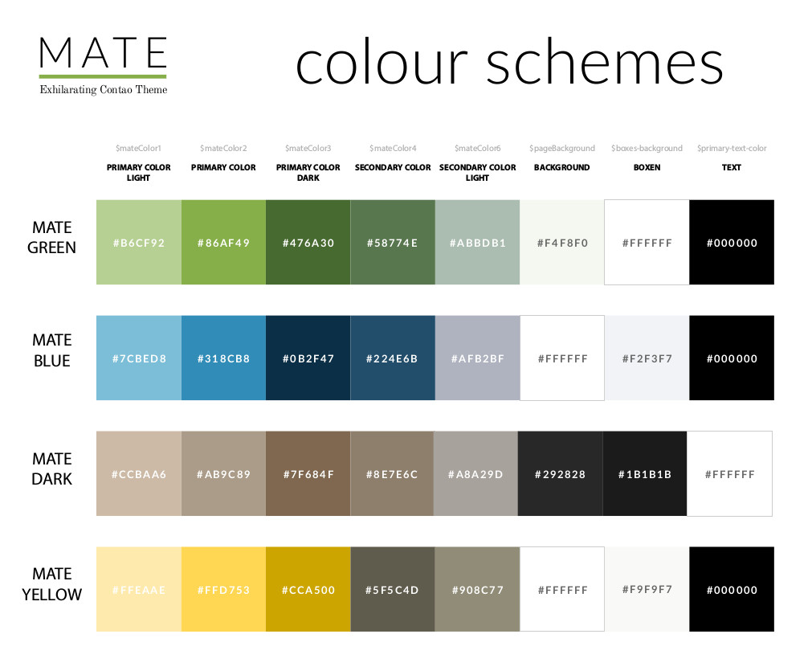

# Farben und Schriften

Wenn das Theme erfolgreich installiert wurde, befinden sich die [SCSS](https://sass-lang.com/documentation/file.SASS_REFERENCE.html)-Dateien in der Dateiverwaltung unter dem Pfad **mate/sass**. Für individuelle Anpassungen nutzen Sie einfach die **custom.scss**, in der Sie sowohl SCSS oder auch normales CSS schreiben können, sowie die** \_custom\_colors.scss **und** \_custom\_variables.scss**.

Ab der Version 1.4.0 gibt es neben der **\_custom\_variables.scss **auch die **\_custom\_colors.scss**. In der **\_custom\_colors.scss** finden Sie alle Farbendefinitionen und die **\_custom\_variables.scss** können Sie nutzen, wenn Sie mehr als nur die Grundfarben des Themes verändern möchten. Wenn Sie eine Variable anpassen möchten, müssen Sie die Zeile auskommentieren \(Schrägstriche entfernen\).

Wenn Sie lieber mit CSS-Dateien statt mit SCSS-Dateien arbeiten wollen, können Sie über **Themes - Stylesheets** einen neuen Stylesheet anlegen und ihn im **Layout** bei **Interne Stylesheets** einbinden. Das CSS wird anschließend automatisch nach dem CSS des Mate Theme geladen.

# Farbschemen

Das MATE Theme wird standardmäßig mit einem grünen Layout ausgeliefert. Ab der Version 1.4.0 gibt es die Möglichkeit das Theme auf ein dunkles \(dark\), blaues \(blue\) oder gelbes Layout \(yellow\) umzustellen.

Wenn Sie auf ein Layout umstellen wollen, kommentieren Sie in der **\_custom\_colors.scss** die entsprechende Zeile bei **Colour Schemes** aus \(Schrägstriche entfernen\). Gegebenenfalls müssen Sie die Seite mit Strg + F5 neuladen, damit die Änderung greift.

Wenn Sie mehrere Farbschemen auf einer Webseite nutzen wollen, können Sie folgende [Anleitung](/mate-farbschema-fuer-einzelne-seite-anpassen.md) befolgen.

# Variablen der \_custom\_colors.scss

#### Grundfarben:

**$mateColor1:** Hauptfarbe helle Abstufung  
**$mateColor2:** Hauptfarbe  
**$mateColor3:** Hauptfarbe dunkle Abstufung  
**$mateColor4:** Sekundärfarbe  
**$mateColor6:** Sekundärfarbe helle Abstufung

**$mateColorWhite:** Weiß  
**$mateColorBlack:** Schwarz  
**$mateColorGreyLight:** Hellgrau  
**$mateColorGreyDark:** Dunkelgrau  
**$pageBackground:** Hintergrundfarbe der Webseite

#### Textfarben:

**$primary-text-color:** Primäre Textfarbe  
**$secondary-text-color:** Sekundäre Textfarbe

#### Boxen:

**$boxes-background:** Hintergrundfarbe der Boxen \(z. B. Contentbox, Teaserbox, News, Events, Login, Newsletter, etc.\)  
**$boxes-text-color:** Schriftfarbe der Boxen \(z. B. Contentbox, Teaserbox, News, Events, Login, Newsletter, etc.\)

#### Content Box:

**$contentbox-first-background:** Hintergrundfarbe der ersten Content-Box  
**$contentbox-second-background:** Hintergrundfarbe der zweiten Content-Box

