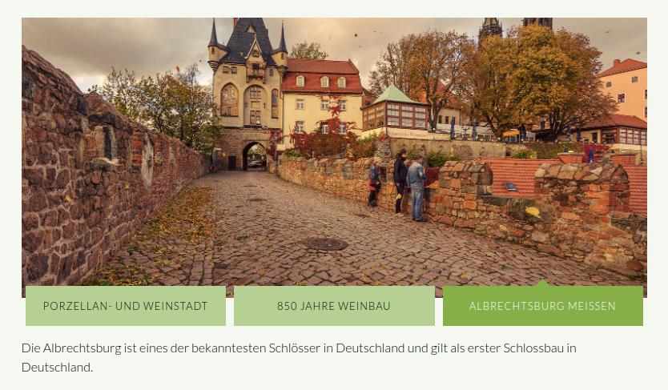
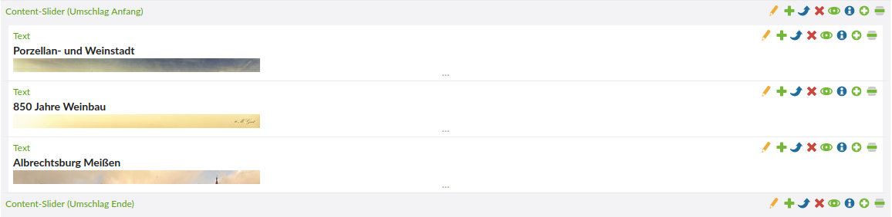
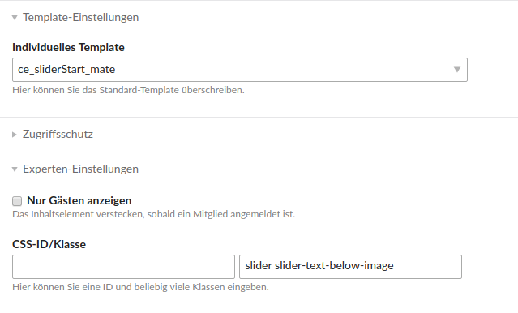

# Inhaltselemente

Alle Module sind bereits auf der Seite **Elemente** beispielhaft eingebunden.

Folgende Elemente werden auf dieser Seite erklärt:
- [Content-Slider](mate-inhaltselemente?id=content-slider)
- [Hyperlinks](mate-inhaltselemente?id=hyperlinks)
- [Media-Elemente](mate-inhaltselemente?id=media-elemente)
- [Überschriften](mate-inhaltselemente?id=Überschriften)

## Content-Slider

#### **Contao-eigener Content-Slider**

Bei dem Element Content-Slider \(Umschlag Anfang\) muss das Template **ce\_sliderStart\_mate** ausgewählt werden. Bei dem abschließenden Element Content-Slider \(Umschlag Ende\) muss das Template **ce\_sliderStop\_mate** ausgewählt werden. Der Slider wird wie im folgenden Beispiel gestylt, wenn die Textelemente die Klasse **slidebox1** bekommen.

Wenn dem Umschlag-Anfang-Element die Klasse **smaller** vergeben wird, wird der Content Slider nur mit einer Höhe von 250px dargestellt.

#### Content-Slider mit Newsbeiträgen

Es ist möglich Newsbeiträge in einem Slider darzustellen. Weitere Infos dazu finden Sie auf der Seite [Theme-Elemente](/mate-theme-elemente.md) unter News-Slider.

#### Content-Slider mit Bild und Text darunter

Um einen Content Slider wie im folgenden Beispiel anzulegen, platzieren Sie **Textelemente** innerhalb der Elemente **Content-Slider (Umschlag Anfang)** und **Content-Slider (Umschlag Ende)**. 

Dem Element vom Typ **Umschlag Anfang** müssen Sie unter den **Experten-Einstellungen** beim zweiten Eingabefeld die Klassen `slider slider-text-below-image` geben sowie bei den **Template-Einstellungen** das Template `ce_sliderStart_mate` auswählen. 

Beim Element vom Typ **Umschlag Ende** wählen Sie noch das Template `ce_sliderStop_mate` aus.

**So sollte der Content Slider aussehen:**

  

**Platzierung der Elemente:**

  

**Auswahl des Templates und Vergeben der Klassen im Umschlag-Start-Element:**

## Hyperlinks

Wenn ein Link wie ein Button \(weiße Schrift auf grünen Hintergrund\) aussehen soll, müssen Sie dem Link die Klasse **btn** geben.

## Media-Elemente

#### Galerie

Je nachdem wie viele Vorschaubilder pro Reihe angezeigt werden sollen, passt sich die Anordnung der Bilder automatisch an und nimmt den kompletten Platz, der zur Verfügung steht, ein.

#### YouTube-Video

Für ein YouTube-Video muss das Template **ce\_youtube\_mate** ausgewählt werden.

## Überschriften

Wenn ein Inhaltselement mit einer Überschrift die Klasse **bordered-left** oder **bordered-right** bekommt, wird die Überschrift mit einem Rahmen unten links bzw. unten rechts dargestellt.

**Überschrift mit einem Rahmen auf der linken Seite:**

**Überschrift mit einem Rahmen auf der rechten Seite:**

