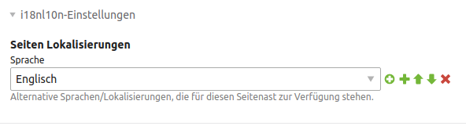
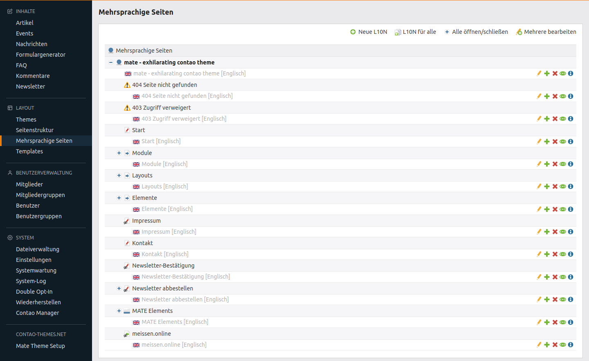

# Mehrsprachigkeit

Um mit dem Mate Theme eine mehrsprachige Webseite aufzubauen, können Sie die Erweiterung [Contao Multilingual Pages [i18nl10n]](https://github.com/exploreimpact/contao-i18nl10n) installieren. So müssen Sie keine Seitenstruktur duplizieren und müssen nur die Elemente, die in verschiedenen Sprachen angezeigt werden, duplizieren. Eine **Dokumentation** für Contao 3 finden Sie [hier](https://github.com/exploreimpact/contao-i18nl10n/wiki), für Contao 4 gibt es zur Zeit noch keine.

Alternativ können Sie ohne diese Erweiterung für jede Sprache eine Seitenstruktur anlegen. Mehr finden Sie dazu im [Contao Handbuch](http://www.contao-handbuch.de/mehrsprachige-webseiten.html).

## Contao Multilingual Pages [i18nl10n]

Wenn Sie die Seitenstruktur nicht duplizieren wollen, installieren Sie über den Contao Manager die Erweiterung **exploreimpact/contao-i18nl10n**.

In der Root-Seite der Seitenstruktur können Sie bei **i18nl10n-Einstellungen** die alternativen Sprachen auswählen.

Unter dem Menüpunkt **Mehrsprachige Webseiten** fügen Sie die Seiten in den anderen Sprachen hinzu. Wenn Sie alle Seiten anlegen wollen, klicken Sie auf **L10N für alle**.

In den Elementen gibt es nun unter **L10n Einstellungen** die Möglichkeit die jeweilige Sprache auszuwählen. Wählen Sie Neutral, wenn das Element in allen Sprachen angezeigt werden soll.

