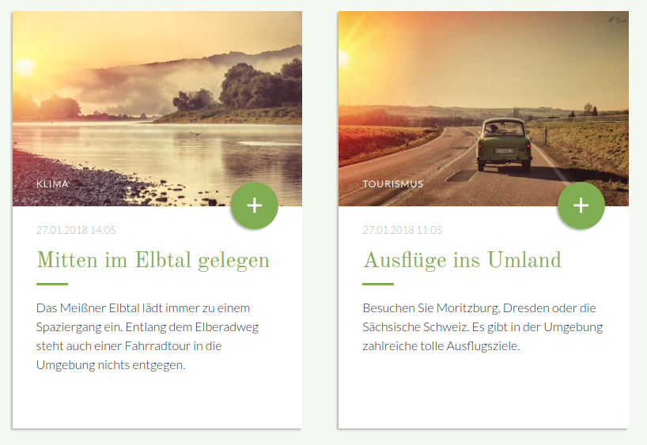
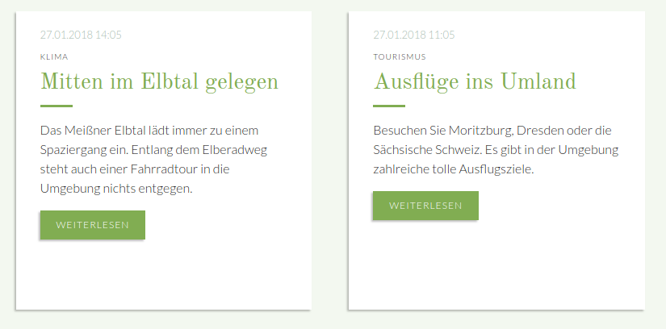
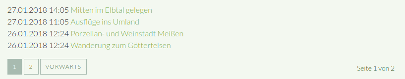
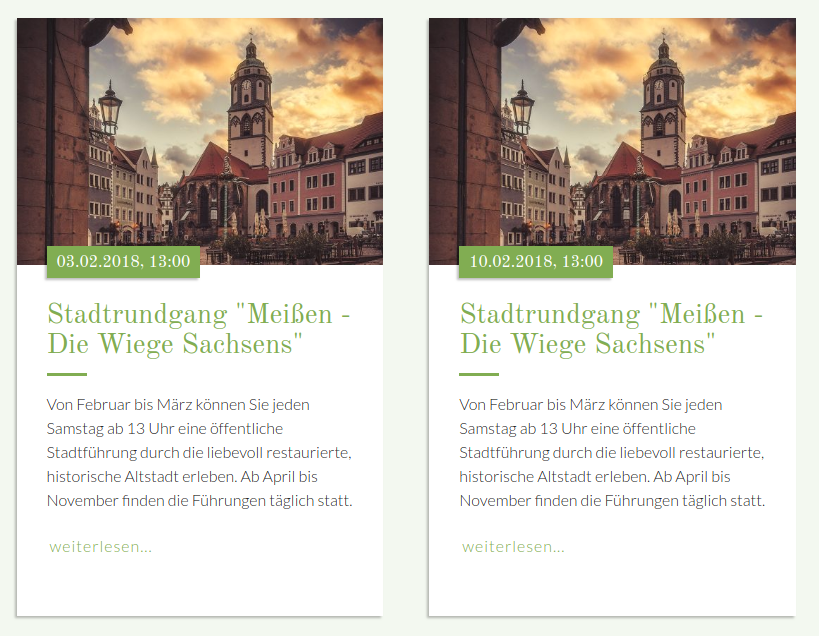
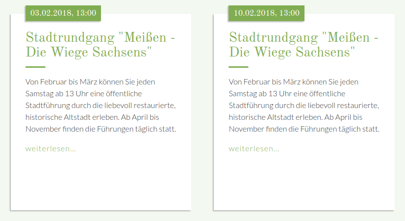
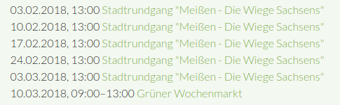
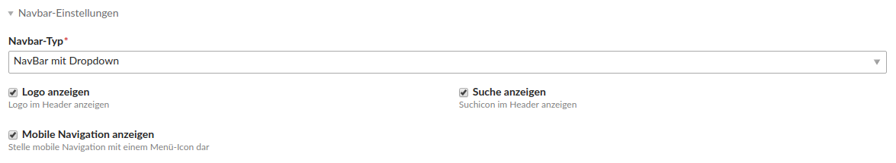
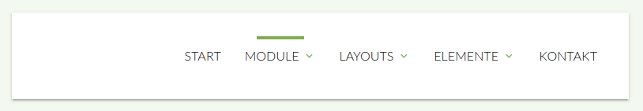
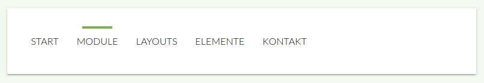
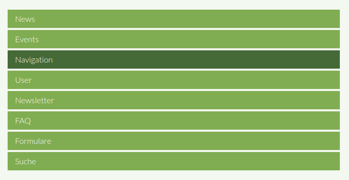

# Module

Alle Module sind bereits auf der Seite **Module** beispielhaft eingebunden.

## News

#### **News mit Bildern und Teaser**

Für News mit Bildern und einem Teasertext muss im Modul das Template **news\_mate\_latest** sowie die Bildgröße N**ews-Box \(520x350\)** ausgewählt werden. Im Modul der Detailansicht muss das Template **news\_mate\_full** ausgewählt werden.

#### **News ohne Bilder und mit Teaser**

Für News ohne Bilder und mit einem Teasertext muss im Modul das Template **news\_mate\_short** ausgewählt werden. Im Modul der Detailansicht muss das Template **news\_mate\_full** ausgewählt werden.

#### **Einfache Newsliste**

Für eine einfache Newsliste ohne Bilder und Teasertext wird kein eigenes Template mitgeliefert. Im Modul der Detailansicht muss das Template **news\_mate\_full** ausgewählt werden.

## Events

#### **Eventliste mit Bildern und Teaser**

Für eine Eventliste mit Bildern und einem Teasertext muss im Modul das Template **event\_mate\_teaser** sowie die Bildgröße **News-Box \(520x350\)** ausgewählt werden. Im Modul der Detailansicht muss das Template **event\_mate\_full** ausgewählt werden.

#### **Eventliste ohne Bilder und mit Teaser**

Für eine Eventliste ohne Bilder und mit einem Teasertext muss im Modul das Template **event\_mate\_list** ausgewählt werden. Im Modul der Detailansicht muss das Template **event\_mate\_full** ausgewählt werden.

#### **Eventliste**

Für eine einfache Eventliste ohne Bilder und Teasertext muss im Modul das Template **event\_mate\_upcoming** ausgewählt werden. Im Modul der Detailansicht muss das Template **event\_mate\_full** ausgewählt werden.

## Navigation

Für die Navigationen gibt es einen eigenen Modultyp **Navbar**. In den Navbar-Einstellungen \(siehe Bild 1\) gibt es die Möglichkeit zwei verschiedene **Navbar-Typen** auszuwählen: **Navbar mit Dropdown** und **Linksbündig**. Beispielintegrationen finden Sie unter dem Menüpunkt Module - Navigation.

###### Bild 1: Navbar-Einstellungen

#### **Dropdown-Navigation**

Das Icon für die Suche und die mobile Navigation sind standardmäßig ausgeblendet, wenn die Navigation nicht im Header platziert wird. Als Navigations-Template wird **mod\_mate\_navbar** verwendet.

#### **Linksbündige Navigation**

Die linksbündige Navigation kann nur eine Navigationsebene darstellen. Das Icon für die Suche und die mobile Navigation sind ebenfalls standardmäßig ausgeblendet, wenn die Navigation nicht im Header platziert wird. Als Navigations-Template wird **mod\_mate\_navbar\_left** verwendet.

#### **Unterseiten-Navigation**

Für eine Unterseiten-Navigation, wie sie z. B. in der Demo in der linken und rechten Spalte platziert ist, wählt man den Navbar-Typ **Linksbündig** aus und vergibt dem Modul die Klasse **subnav**. Logo, Suche und mobile Navigation müssen ausgeblendet werden.

## Login-Formular

Für den Modultyp Login-Formular muss das individuelle Template **mod\_login\_mate** ausgewählt werden.

## Formulare

Für das Feld Dateiupload muss das individuelle Template **form\_mate\_upload**\_ \_ausgewählt werden.

## Suche

Für das Suchmaschinen-Modul muss das Template **search\_mate** ausgewählt werden.

