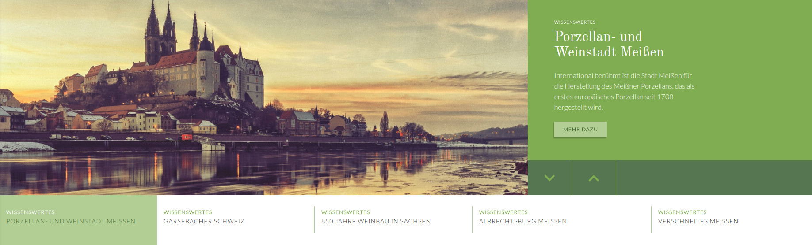
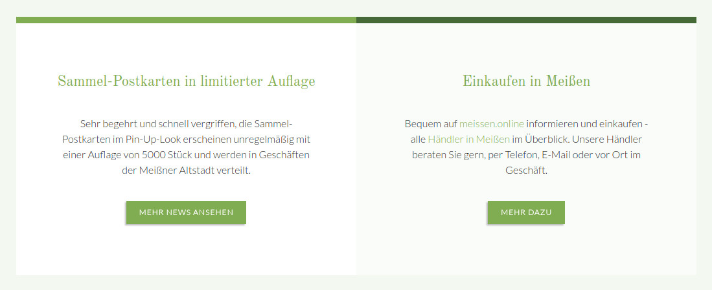
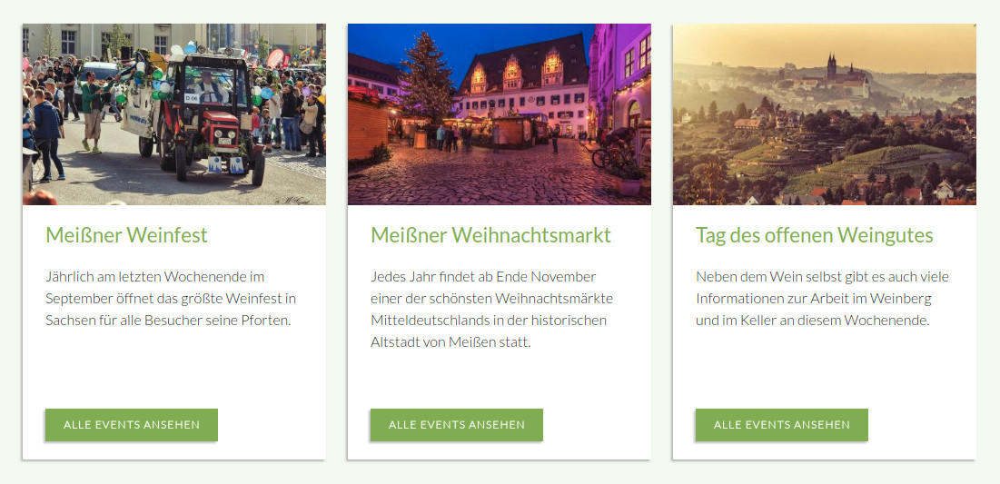
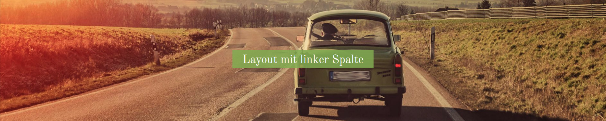
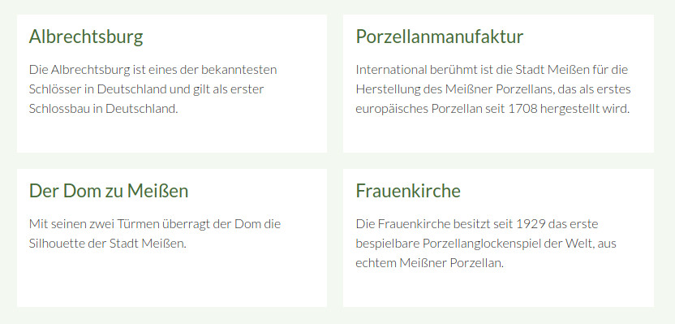
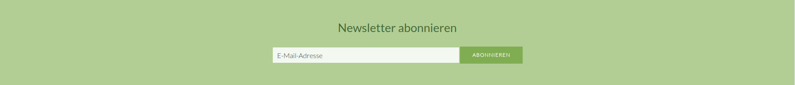

# Theme-Elemente

Auf dieser Seite sind alle Elemente aufgelistet, die das Theme bereits mitbringt.

## News-Slider

Im News-Slider ist es möglich Newsbeiträge in einem Slider darzustellen. Der Slider ist auf der Startseite der Demo-Seite eingebunden. Im Theme ist der Slider im Artikel **Start** in der **Kopfzeile** über den Insert-Tag `{{theme::content::MATE02/01}}` eingebunden.

Sie benötigen dafür keine Content-Slider Umschlag-Elemente, sondern müssen lediglich ein Modul vom Typ **Nachrichtenliste** einbinden. Beim Nachrichtentemplate muss **news\_mate\_slider** sowie beim individuellen Template **mod\_newslist\_mate\_slider** ausgewählt werden. Die Gesamtanzahl der Beiträge ist variabel auswählbar.

Das Bild sowie die Teasertexte können Sie jeweils in den Beitragseinstellungen des Newsbeitrages auswählen.

## Content-Box

Für die Content-Box muss der Elementtyp **Content-Box** ausgewählt werden. Die Hintergrundfarbe kann geändert werden, indem man dem Element Klassen vergibt \(z. B. "grey lighten-3", für mehr Informationen siehe Abschnitt [Farben](/mate-materialize.md) oder man das CSS \(custom.scss\) anpasst. Erläuterungen, wie Elemente nebeneinander dargestellt werden können, finden Sie im Abschnitt [Grid](/mate-materialize.md).

## Teaser-Box

Für die Teaser-Box muss der Elementtyp **Teaserbox** ausgewählt werden. Die Breite der Boxen kann durch das Vergeben von CSS-Klassen angepasst werden. Wenn ein Bild hinzugefügt wird, muss die Bildgröße **Teaser-Box \(450x270\)** ausgewählt werden.

## Headerbild

Für das Headerbild muss der Elementtyp **Bild** sowie das Template **ce\_image\_mate\_headerimage** ausgewählt werden. Der Bildausschnitt kann über das Festlegen des wichtigen Bereiches im Bild ausgewählt werden.

Eine Beispielintegration für ein normales Headerbild finden Sie in der Demo-Seite auf den Layout-Seiten. Eine Beispielintegration für ein schmales Headerbild finden Sie auf der Seite Kontakt.

**Normales Headerbild:**

**Schmales Headerbild:**

Für ein schmaleres Headerbild muss dem Element die Klasse **smaller** gegeben werden.  

**Links ausgerichtetes Headerbild:**

Für ein links ausgerichtetes Headerbild geben Sie dem Element einfach die Klasse **left**.

**Rechts ausgerichtetes Headerbild:**

Für ein rechts ausgerichtetes Headerbild geben Sie dem Element einfach die Klasse **right**.

## Einfache Inhaltsbox

Man kann einem Element vom **Elementtyp Text** einen weißen Hintergrund mit etwas Abstand geben, indem man dem Element das individuelle Template **ce\_text\_simplebox\_mate** vergibt.

## Newsletter-Box

Im Footer ist es möglich einen Bereich für die Newsletter-Anmeldung zu integrieren. Die Newsletter-Box ist im **Modul Footer** über den Insert-Tag `{{theme::content::MATE02/01}}` eingebunden. Das Modul dazu ist in einem Artikel unter **MATE Elements - Moduls - 02/02 newsletter** eingebunden. Damit das CSS geladen wird, muss der Artikel die ID **newsletter** besitzen.

