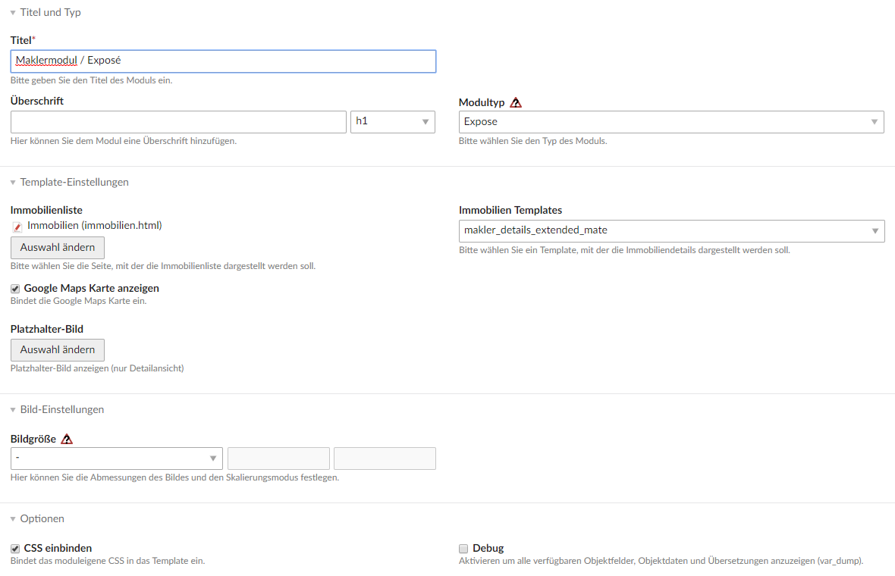
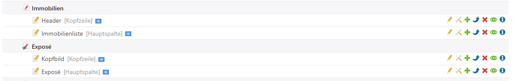
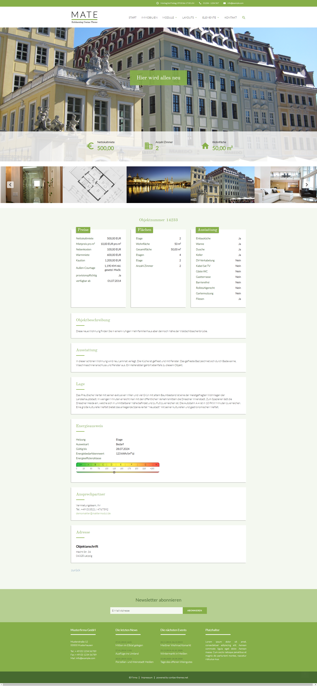

# Maklermodul

Das MATE Theme liefert bereits Templates und Stylesheets für das [Maklermodul](https://www.maklermodul.de/) mit.

## Dokumentation

In der [Maklermodul-Dokumentation](https://docs.pdir.de/#/maklermodul/index) finden Sie alle Informationen zur Installation und Einrichtung des Maklermoduls.

## Stylesheets einbinden

Fügen Sie folgende Zeile in der **custom.scss** (/files/mate/sass) ein, damit die Listen- und Detailansicht entsprechend den Screenshots dargestellt wird.

```
@import 'maklermodul';
```

## Einrichtung

### Seiten anlegen

Legen Sie zuerst jeweils eine Seite für die Listen- und Detailansicht an.

### Listenansicht-Modul

Legen Sie ein Modul vom Typ **Immobilienliste** entsprechend der [Dokumentation](https://docs.pdir.de/#/maklermodul/einrichtung) an.

* Immobilien-Template **makler_list_mate** auswählen
* Bildgröße **Maklermodul / Listenansicht** auswählen


### Detailansicht-Modul

Legen Sie ein Modul vom Typ **Expose** entsprechend der [Dokumentation](https://docs.pdir.de/#/maklermodul/einrichtung) an.

* Immobilien-Template **makler_details_extended_mate** auswählen



### Kopfbild-Modul

Legen Sie ein Modul vom Typ **MaklerModul Kopfbild** entsprechend der [Dokumentation](https://docs.pdir.de/#/maklermodul/kopfbild_mit_uberschrift) an.


### Platzieren der Module

Platzieren Sie die Module für die Listenansicht und das Exposé unter den jeweiligen Seiten in den Artikeln. Legen Sie für das Kopfbild noch einen weiteren Artikel an, der in der Kopfzeile platziert ist (über dem Artikel der Detailansicht).



## Beispiele

Wenn Sie alle Schritte wie beschrieben durchgeführt haben, sollte die Liste entsprechend den folgenden Screenshots dargestellt werden.

### Listenansicht mit Button-Filter


### Listenansicht mit Auswahllisten-Filter


### Exposé


