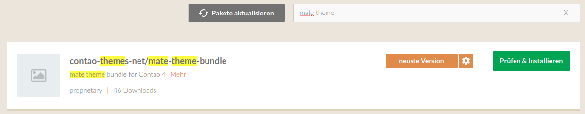
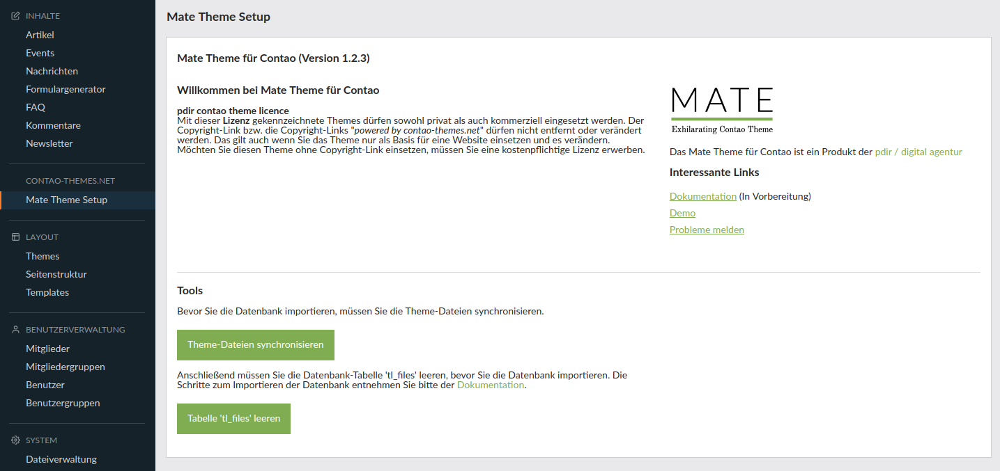
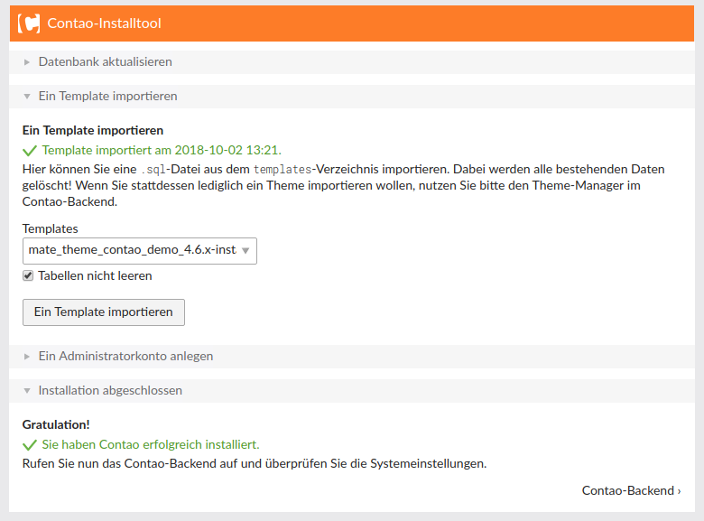
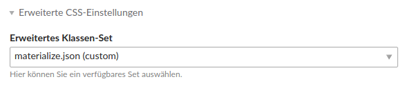

# Installation

## Voraussetzungen

Das Theme kann nur in einer **leeren Contao-Installation** installiert werden und ist mit **Contao 4.4.x oder höher** kompatibel.

Die folgenden Schritte sind <strong>nur bei der ersten Installation</strong> notwendig und nicht bei einem Update des Mate Themes. Wenn Sie das Theme aktualisieren wollen, können Sie das ganz einfach über den Contao Manager durchführen. Anschließend rufen Sie das Install-Tool auf und aktualisieren die Datenbank.   Ein <strong>Backup der Datenbank</strong> kann nie schaden!   Wenn Sie von der Version 1.x auf 2.x updaten wollen, beachten Sie unsere <a href="#/mate_theme/mate-update-version-2.0">Hinweise</a> dazu.

## Wichtige Schritte

### Mate Theme Bundle installieren

Rufen Sie als erstes den Contao Manager über die folgende URL auf: [www.ihre-domain.de/contao-manager.phar.php](/www.ihre-domain.de/contao-manager.phar.php). Wählen Sie die Schaltfläche **Pakete installieren** aus und geben im Suchfeld **mate theme** ein \(siehe Bild 1\). Installieren Sie das Bundle **contao-themes-net/mate-theme-bundle**, indem Sie auf den Button **Prüfen & Installieren** klicken und anschließend mit **Änderungen anwenden** die Installation starten. Danach rufen Sie das **Install-Tool** auf und aktualisieren die Datenbank. Im Install-Tool müssen sie noch einen Admin-Benutzeraccount erstellen.

Bild 1: Mate Theme Bundle installieren

### Theme-Dateien synchronisieren und Tabelle 'tl\_files' leeren

Loggen Sie sich mit Ihrem erstellten Benutzer-Account im Backend ein und wählen Sie in der linken Navigation unter **MATE THEME** den Menüpunkt **Mate Theme Setup** aus. Anschließend klicken Sie auf den Button **Theme-Dateien synchronisieren** \(siehe Bild 2\). Damit werden alle Dateien in der Dateiverwaltung unter dem Ordner mate angelegt und die SQL-Dateien zum Importieren der Datenbank in den templates-Ordner kopiert.

Danach müssen die die Datenbank-Tabelle 'tl\_files' leeren, indem Sie auf den Button **Tabelle 'tl\_files' leeren** klicken. Dieser Schritt muss vor dem Importieren der Datenbank erfolgen.

Mit dem Leeren der <strong>tl_files</strong> Tabelle werden die Bilder-Verknüpfungen gelöscht. Das ist nur bei der ersten Installation des Themes notwendig.

Bild 2: Theme-Dateien synchronisieren

### Datenbank importieren

Rufen Sie nun das Install-Tool auf. Unter dem Reiter **Ein Template importieren **\(siehe folgender Screenshot\) können Sie eine .sql-Datei aus dem templates-Verzeichnis importieren. Wählen Sie die Datei für Ihre Contao-Version aus und aktivieren Sie den Haken **Tabellen nicht leeren**. Anschließend klicken Sie auf Ein Template importieren.

Wenn die Datenbank erfolgreich importiert wurde, sollten Sie eine Meldung, dass ein Template importiert wurde, wie im folgenden Screenshot, erhalten.

Alternativ können Sie die sql-Datei auch über phpMyAdmin importieren.

Bild 3: Ein Template importieren

### Symlinks neu erstellen

Anschließend wechseln Sie wieder ins Contao-Backend, wählen den Menüpunkt **Systemwartung** aus und erstellen die Symlinks neu, indem Sie die Checkbox bei **Symlinks neu erstellen** auswählen und anschließend den Button **Daten bereinigen** betätigen.

## Einstellungen

In den **Einstellungen** müssen Sie unter Frontend-Einstellungen **Auto\_item** und **Ordner-URLs verwenden** aktivieren. Ab Contao 4.7 gibt es die Einstellung Auto_Item aktivieren im Backend nicht mehr, es ist immer standardmäßig aktiv.

Bild 4: Frontend-Einstellungen

Unter **Erweiterte CSS-Einstellungen** müssen SIe noch das Klassen-Set **materialize.json** auswählen \(siehe Bild 5\).

  
Bild 5: Erweiterte CSS-Einstellungen