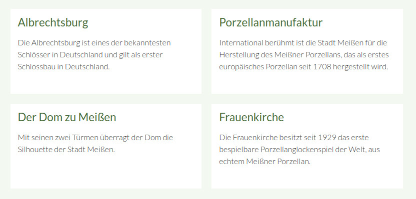
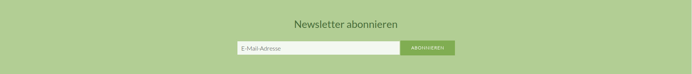

# Theme-Elemente

Auf dieser Seite sind alle Elemente aufgelistet, die das Theme bereits mitbringt.

Folgende Elemente werden auf dieser Seite erklärt:
- [Content-Box](mate_theme/mate-theme-elemente?id=content-box)
- [CountTo](mate_theme/mate-theme-elemente?id=countto)
- [Einfache Inhaltsbox](mate_theme/mate-theme-elemente?id=einfache-inhaltsbox)
- [Headerbild](mate_theme/mate-theme-elemente?id=headerbild)
- [Kundenstimmen-Slider](mate_theme/mate-theme-elemente?id=kundenstimmen-slider)
- [News-Slider](mate_theme/mate-theme-elemente?id=news-slider)
- [Newsletter-Box](mate_theme/mate-theme-elemente?id=newsletter-box)
- [Parallax-Element](mate_theme/mate-theme-elemente?id=parallax-element)
- [Teaser-Box](mate_theme/mate-theme-elemente?id=teaser-box)

## Content-Box

Für die Content-Box muss der Elementtyp **Content-Box** ausgewählt werden. Die Hintergrundfarbe kann geändert werden, indem man dem Element Klassen vergibt \(z. B. "grey lighten-3", für mehr Informationen siehe Abschnitt [Farben](mate_theme/mate-materialize.md) oder man das CSS \(custom.scss\) anpasst. Erläuterungen, wie Elemente nebeneinander dargestellt werden können, finden Sie im Abschnitt [Grid](mate_theme/mate-materialize.md).


## CountTo

In der Version 2.1.0 des Mate Theme ist das CountTo Feature hinzugekommen. Damit können Zahlen hochgezählt werden, wenn Sie in das Sichtfenster gelangen. Ein Beispiel finden Sie in der [Mate Theme Demo](https://mate.pdir.de/mate-elemente.html#countto).

Sollen die Elemente wie im Beispiel nebeneinander dargestellt werden, platzieren Sie **Textelemente** innerhalb eines Elementes vom Typ **Grid (Grid-Start)** und **Grid (Grid-Stop)**. Im Textelement können Sie unter **Erweiterte CSS-Klassen** die Spaltenbreiten festlegen, siehe Bild. Im Abschnitt [Grid](mate_theme/mate-materialize?id=grid) wird dies nochmal genauer beschrieben.

Dem Grid-Start-Element müssen Sie unter den **Experten-Einstellungen** die Klasse `count-to-container` geben, ansonsten wird es nicht wie im Beispiel gestylt. 

Nutzen Sie unseren [Material Icons Inserttag](https://github.com/contao-themes-net/material-icons-inserttag) um ein Icon zu setzen, z. B. `{{mi::place}}`. `place` wäre in diesem Fall der Name des Icons und kann beliebig getauscht werden. Eine Liste mit den Material Icons und deren Namen finden Sie ebenfalls in unserer [Dokumentation](https://mate.pdir.de/style-guide/icons.html). 

Das Label haben wir in unserem Beispiel als h6-Überschrift im Text gesetzt. 

Für die Zahl nutzen Sie ebenfalls unseren **CountTo Inserttag**, z. B. `{{countTo::929::founded}}`. An zweiter Stelle steht immer die Zahl, an dritter Stelle können Sie eine ID vergeben. Wenn Sie mehrere Inserttags auf einer Seite einbinden, müssen Sie jeweils eine **eindeutige ID** vergeben.

**Beispiel:**


**Beispielhafte Platzierung der Elemente im Artikel:**


**Textelement:**


**Spaltenbreiten setzen im Textelement:**


## Einfache Inhaltsbox

Man kann einem Element vom **Elementtyp Text** einen weißen Hintergrund mit etwas Abstand geben, indem man dem Element das individuelle Template **ce\_text\_simplebox\_mate** vergibt.



## Headerbild

Für das Headerbild muss der Elementtyp **Bild** sowie das Template **ce\_image\_mate\_headerimage** ausgewählt werden. Der Bildausschnitt kann über das Festlegen des wichtigen Bereiches im Bild ausgewählt werden.

Eine Beispielintegration für ein normales Headerbild finden Sie in der Demo-Seite auf den Layout-Seiten. Eine Beispielintegration für ein schmales Headerbild finden Sie auf der Seite Kontakt.

**Normales Headerbild:**


**Schmales Headerbild:**

Für ein schmaleres Headerbild muss dem Element die Klasse **smaller** gegeben werden.  


**Links ausgerichtetes Headerbild:**

Für ein links ausgerichtetes Headerbild geben Sie dem Element einfach die Klasse **left**.


**Rechts ausgerichtetes Headerbild:**

Für ein rechts ausgerichtetes Headerbild geben Sie dem Element einfach die Klasse **right**.


## Kundenstimmen-Slider

In der Version 2.1.0 des Mate Theme ist ein Kundenstimmen-Slider hinzugekommen. Beispiele finden Sie in der [Mate Theme Demo](https://mate.pdir.de/inhaltselemente/content-slider.html).

Platzieren Sie zuerst jeweils ein Element vom Typ **Content Slider (Umschlag Anfang)** und **Content Slider (Umschlag Ende)**. In dem Umschlags-Element können Sie beliebig viele Elemente vom Typ **Text-Element mit Hintergrundbild** platzieren. Dort haben Sie die Möglichkeit einen Text einzugeben sowie ein Bild (Profilbild) und ein Hintergrundbild zu setzen.

Soll der Slider schmal dargestellt werden (siehe Dokumentation), dann geben Sie dem Element **Content Slider (Umschlag Anfang)** unter den **Experten-Einstellungen** (das zweite Eingabefeld) die Klasse `smaller`.  

**Beispiel eines Kundenstimmen-Sliders:**

  

**Platzierung der Elemente im Artikel:**

 

**Elementtyp auswählen und Eingabe des Textes:**

  

**Bild (Profilbild) auswählen:**

  

**Hintergrundbild auswählen:**

  

#### Unschärfe beim Hintergrundbild entfernen:

Die Unschärfe des Hintergrundbildes können Sie durch folgendes CSS, das in die **custom.scss** unter **files/mate/sass** eingefügt werden muss, entfernen:

```
.ce_mateTextBackgroundElement .bg-image {
    filter: none;
}
```

## News-Slider

Im News-Slider ist es möglich Newsbeiträge in einem Slider darzustellen. Der Slider ist auf der Startseite der Demo-Seite eingebunden. Im Theme ist der Slider im Artikel **Start** in der **Kopfzeile** über den Insert-Tag `{{theme::content::MATE02/01}}` eingebunden.

Sie benötigen dafür keine Content-Slider Umschlag-Elemente, sondern müssen lediglich ein Modul vom Typ **Nachrichtenliste** einbinden. Beim Nachrichtentemplate muss **news\_mate\_slider** sowie beim individuellen Template **mod\_newslist\_mate\_slider** ausgewählt werden. Die Gesamtanzahl der Beiträge ist variabel auswählbar.

Das Bild sowie die Teasertexte können Sie jeweils in den Beitragseinstellungen des Newsbeitrages auswählen.


Wenn Sie die Position des Text und Bildes vertauschen wollen, bearbeiten Sie die **Beitragseinstellungen** der News und fügen unter **Experten-Einstellungen** die CSS-Klasse `image-right` ein.


## Newsletter-Box

Im Footer ist es möglich einen Bereich für die Newsletter-Anmeldung zu integrieren. Die Newsletter-Box ist im **Modul Footer** über den Insert-Tag `{{theme::content::MATE02/01}}` eingebunden. Das Modul dazu ist in einem Artikel unter **MATE Elements - Moduls - 02/02 newsletter** eingebunden. Damit das CSS geladen wird, muss der Artikel die ID **newsletter** besitzen.



## Parallax-Element

In der Version 2.1.0 des Mate Theme ist das Parallax-Element hinzugekommen. Platzieren Sie dafür im Artikel ein Element vom Typ **Parallax-Element**. Dort haben Sie die Möglichkeit eine Überschrift, den Text, die Höhe, einen Link sowie ein Bild zu setzen. In der [Mate Theme Demo](https://mate.pdir.de/elemente/parallax-element.html) finden Sie Beispiele für Parallax-Elemente.

  

  

## Teaser-Box

Für die Teaser-Box muss der Elementtyp **Teaserbox** ausgewählt werden. Die Breite der Boxen kann durch das Vergeben von CSS-Klassen angepasst werden. Wenn ein Bild hinzugefügt wird, muss die Bildgröße **Teaser-Box \(450x270\)** ausgewählt werden.

