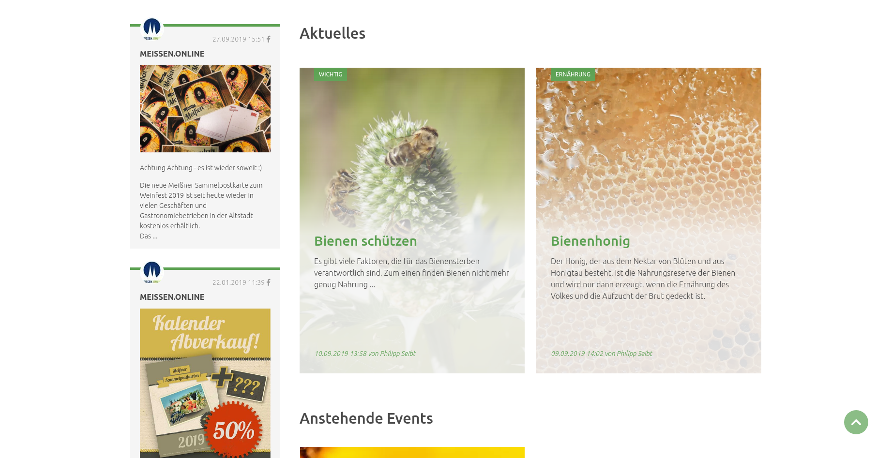
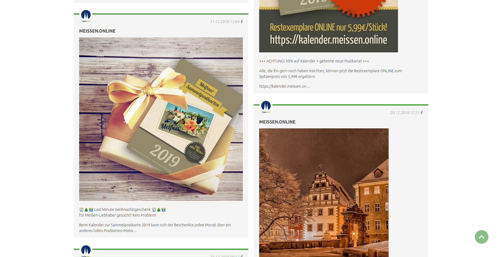
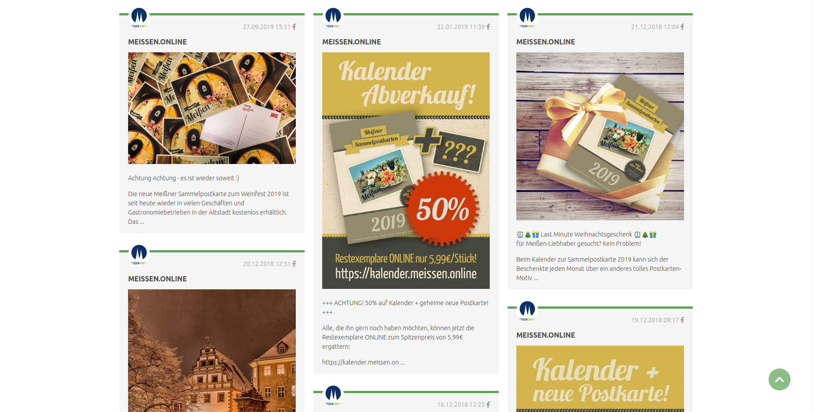
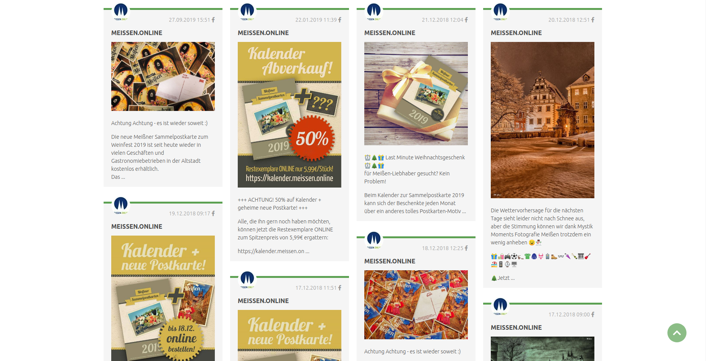

# Andere Erweiterungen

## Social Feed Bundle

Mit dem Social Feed Bundle können Sie Beiträge von Facebook und Instagram im NATURE Theme anzeigen lassen. Installieren Sie dafür einfach über den Contao Manager das Paket mit dem Namen **pdir/social-feed-bundle**.

Eine Anleitung wie Sie den Facebook-Stream einrichten und wie Sie die Module platzieren, finden Sie auf folgender Seite: [Social Feed Dokumentation](https://pdir1.gitbook.io/documentation-for-contao-extensions-by-pdir/social-feed).  

Bei der Einrichtung des Nachrichten-Moduls wählen Sie bei dem **Nachrichtentemplate** `news_social_feed_nature` aus.

Der Social Feed ist im Nature Theme bereits entsprechend der folgenden Screenshots gestylet.

