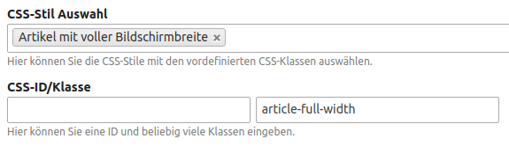

# Artikel

## CSS-Stile

In den **Artikeleinstellungen** haben Sie unter **CSS-Stil Auswahl** die Möglichkeit zwischen verschiedenen CSS-Stilen zu wählen.

- **Artikel mit voller Bildschirmbreite:** Ohne Abstand nach links und rechts.

- **Artikel mit voller Bildschirmhöhe:** Inhalt nimmt mindestens die Bildschirmhöhe ein und wird vertikal zentriert. Beispiele finden Sie in der [Demo](https://nature.contao-themes.net/artikel-mit-hintergrund.html).

## CSS-Klassen

Um die Hintergrund- oder Textfarbe des Artikels zu ändern, können Sie verschiedene CSS-Klassen definieren, z. B. `has-text-white` und `has-background-dark` für einen dunklen Hintergrund mit weißen Text. Beispiele finden Sie in der [Demo](https://nature.contao-themes.net/artikel-mit-hintergrund.html).

Alle verfügbaren Klassen finden Sie in der [Bulma Dokumentation](https://bulma.io/documentation/modifiers/color-helpers/).