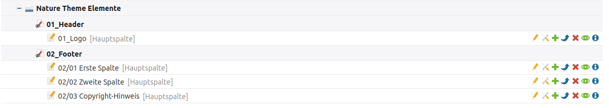
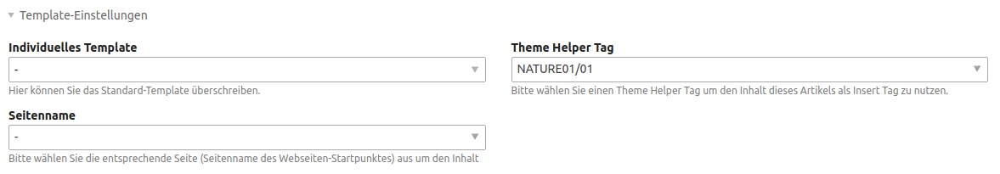

# Einrichtung

## Theme anpassen

Wie Sie das Theme anpassen (z. B. Farben, Schriften, Schriftgrößen, Header, Footer) sowie eigenes CSS definieren können, ist auf der Seite [Theme anpassen](nature_theme/theme-anpassen.md) erklärt.

## JavaScript-Anpassungen

Für eigenes JavaScript legen Sie sich bitte eine eigene Datei an und binden diese im Theme ein.

## Elemente über ein eigenes Insert-Tag platzieren

Unter der Seite **Nature Theme Elemente** befinden sich Artikel, die mittels eines Insert-Tags an jeder beliebigen Stelle der Webseite eingebunden werden können. Zu den Artikeln gelangen Sie, indem Sie im linken Menü auf **Artikel** klicken und ganz nach unten scrollen. 

In den **Artikel-Einstellungen** des jeweiligen Artikels (Werkzeug-Icon\) wählt man dafür unter **Template-Einstellungen** den passenden **Theme Helper Tag** aus. Im Feld Seitenname kann man die jeweilige Seite auswählen, was aber nur bei einer Multi-Domain-Installation notwendig ist.

Den Artikel kann man danach über folgenden Insert-Tag u. a. in einem **HTML-Element** oder einem **Template** platzieren: z. B.  `{{theme::content::NATURE01/01}}`.