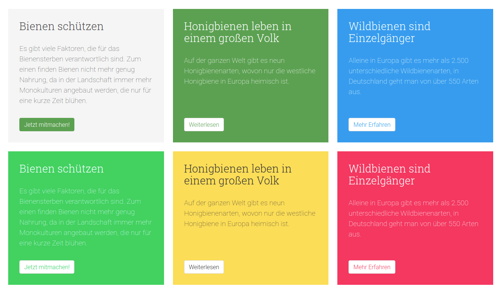
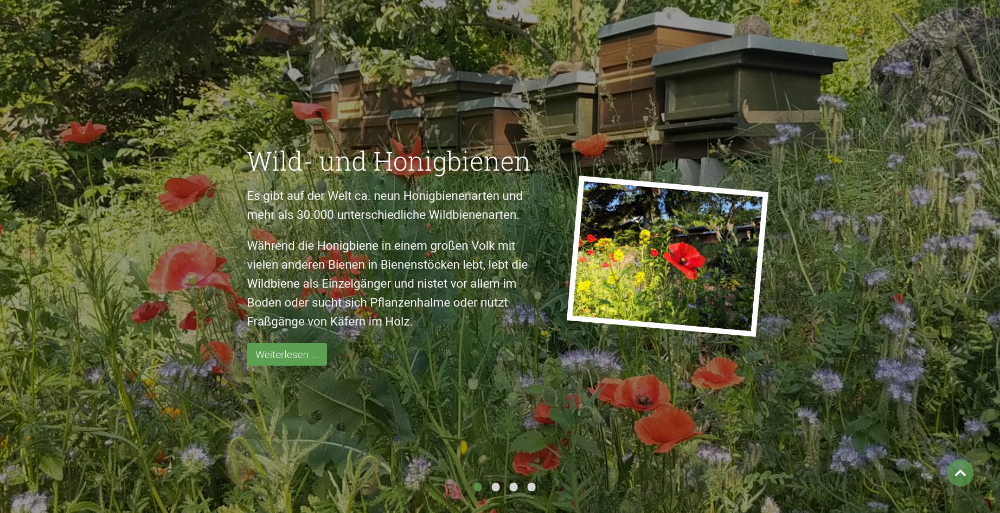
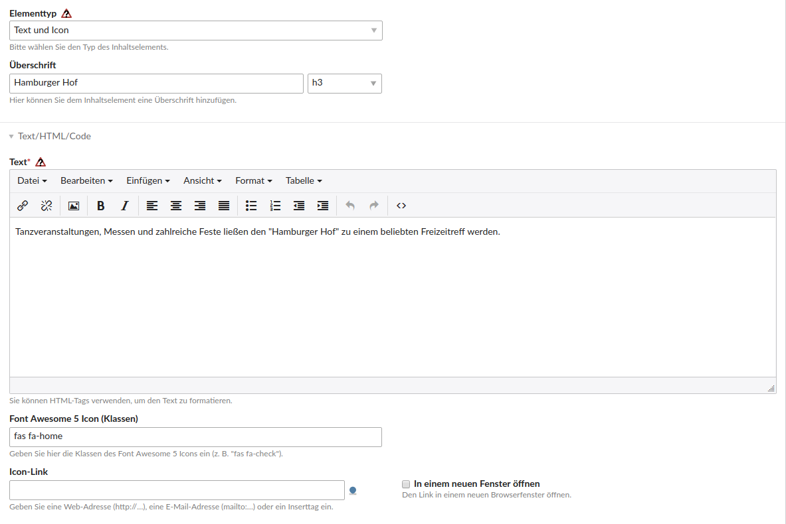
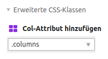
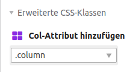
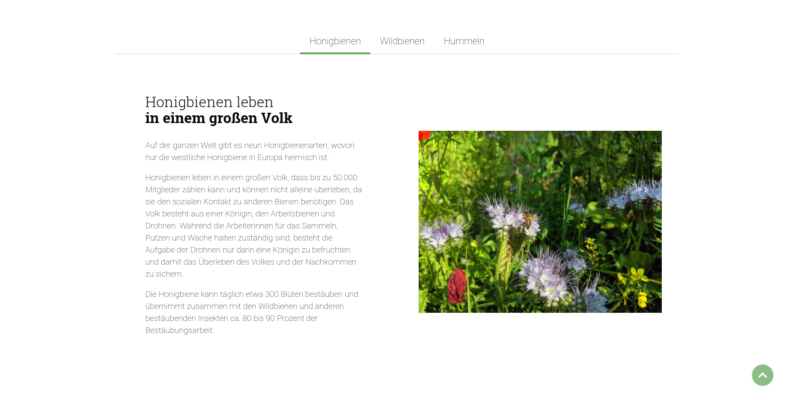
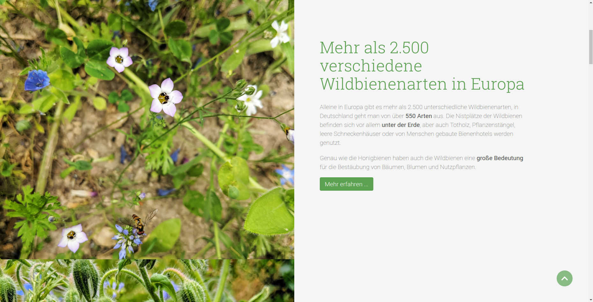

# Elemente

Auf dieser Seite sind alle Elemente, die das Theme mitliefert oder anzupassen sind, erklärt und wie Sie diese einsetzen können.

Folgende Elemente werden auf dieser Seite erklärt:
- [Buttons](nature_theme/elemente?id=buttons)
- [Content-Box](nature_theme/elemente?id=content-box)
- [Content-Slider](nature_theme/elemente?id=content-slider)
- [Feature-Element](nature_theme/elemente?id=feature-element)
- [Grid](nature_theme/elemente?id=grid)
- [Headerbild](nature_theme/elemente?id=headerbild)
- [Hero-Element](nature_theme/elemente?id=hero-element)
- [Listen](nature_theme/elemente?id=listen)
- [Preistabelle](nature_theme/elemente?id=preistabelle)
- [Tabellen](nature_theme/elemente?id=tabellen)
- [Tabs](nature_theme/elemente?id=tabs)
- [Teaserbox](nature_theme/elemente?id=teaserbox)

## Buttons

Für einen Button platzieren Sie ein Element vom Typ **Hyperlink** und wählen das Template `ce_hyperlink_button` aus. Bei Erweiterte CSS-Klassen können Sie noch weitere Klassen definieren um das Aussehen der Buttons zu verändern, siehe [Bulma Dokumentation](https://bulma.io/documentation/elements/button/).

---

## Content-Box

#### Element platzieren

Um eine Content-Box hinzuzufügen, platzieren Sie ein Element vom Typ **Content Box**.

Um mehrere Elemente nebeneinander darzustellen, platzieren Sie diese Elemente wie im Abschnitt [Grid](nature_theme/elemente?id=grid) beschrieben.

#### Farben ändern

Unter **Erweiterte CSS-Klassen** können Sie eine Klasse für die **Hauptfarbe** auswählen, wenn die Content Box in einer anderen Hintergrundfarbe dargestellt werden soll: `.is-primary`, `.is-link`, `.is-info`, `.is-success`, `.is-warning` und `.is-danger`. Wird keine Klasse ausgewählt, wird sie wie das erste Element im folgenden Screenshot dargestellt.

#### Beispiele

---

## Content-Slider

#### Artikel platzieren

Für einen vollflächigen Slider, wie auf der Startseite, platzieren Sie diesen in einem eigenen Artikel. In den **Artikeleinstellungen** wählen Sie unter **Experteneinstellungen** bei **CSS-Stil-Auswahl** `Artikel mit voller Bildschirmbreite` aus.

#### Elemente platzieren

Im Artikel platzieren Sie die Elemente **Content-Slider (Umschlag Anfang)** und **Content-Slider (Umschlag Ende)**. Zwischend den Umschlagselementen platzieren Sie jeweils ein Element vom Typ **Slider-Element**.

#### CSS-Stile für Umschlags-Anfangs-Element

Beim Umschlag-Anfangs-Element müssen Sie bei **CSS-Stil Auswahl** `Slider mit voller Breite und Höhe` auswählen. Zusätzlich können Sie auch noch `Parallax-Slider` auswählen, der für den Parallax-Effekt des Textes, wenn man nach unten scrollt, sorgt.

#### Slider-Element

Beim Slider-Element haben Sie die Möglichkeit eine Überschrift, Text, Bild, Verlinkung und ein Hintergrundbild- oder Video zu setzen.

Zusätzlich haben Sie bei **CSS-Stil Auswahl** auch noch die Wahl zwischen einem dunkleren Bild oder weißen Text. Wenn Sie keine der Klassen auswählen, wird der Text in schwarz dargestellt.

#### Beispiel

---

## Feature-Element

#### Element platzieren

Platzieren Sie ein Element vom Typ **Text und Icon**.

Sie können eine Überschrift, einen Text sowie das Font-Awesome Icon und ggf. einen Link definieren. Eine Liste mit den möglichen Icons finden Sie auf der Seite von [Font Awesome](https://fontawesome.com/icons?d=gallery&m=free). Wenn Sie ein Icon anklicken, sehen Sie oben auch die Klassen, die Sie in das Eingabefeld **Font Awesome 5 Icon (Klassen)** einfügen müssen.

#### Element mit Hintergrund

Wenn das Element einen Hintergrund wie im folgenden Screenshot erhalten soll, wählen Sie unter den **Template-Einstellungen** `ce_cthemes_feature_element_nature` aus.

#### Beispiele

---

## Grid

Das Theme basiert auf [Bulma](https://bulma.io), womit Sie u. a. Elemente ganz einfach nebeneinander und gleichzeitig für mobile Geräte in einer Spalte darstellen können.

#### Platzieren der Inhaltscontainer

Um beispielsweise zwei Textelemente nebeneinander darzustellen, fügen Sie zuerst jeweils ein Element vom Typ **Contao Themes (Inhaltscontainer Anfang)** und **Contao Themes (Inhaltscontainer Ende)** hinzu.

Das Element vom Typ **Inhaltscontainer Anfang** muss unter **Erweiterte CSS-Klassen** das Col-Attribut `.columns` bekommen.

#### Erweiterte CSS-Klassen 

Zwischen den Umschlagselementen platzieren Sie die Elemente, die Sie nebeneinander darstellen möchten. Dabei müssen Sie unter **Erweiterte CSS-Klassen** das Col-Attribut `.column` auswählen.

Zusätzlich können Sie auch noch weitere Klassen definieren, u. a. Spaltenbreiten für bestimmte Auflösungen, Spalten-Abstände und die Ausrichtung. Weitere Informationen finden Sie in der [Bulma Dokumentation](https://bulma.io/documentation/columns/).

#### Beispiel

---

## Headerbild

#### Artikel platzieren

Platzieren Sie das Headerbild in einem eigenen Artikel in der Kopfzeile. In den **Artikeleinstellungen** wählen Sie unter **Experteneinstellungen** bei **CSS-Stil-Auswahl** `Artikel mit voller Bildschirmbreite` aus.

#### Element platzieren

Um ein Headerbild zu platzieren verwenden Sie den Elementtyp **Bild** und wählen unter Template-Einstellungen das Template **ce\_image\_headerimage** hinzu. 

#### CSS-Stile

Bei **CSS-Stil Auswahl** haben Sie optional die Auswahl zwischen einem dunkleren Bild, weißen Text und einem größeren Headerbild.

#### Beispiele

 

---

## Hero-Element

#### Element platzieren

Um ein Hero-Element (Textelement mit Hintergrund) hinzuzufügen, platzieren Sie ein Element vom Typ **Text** und wählen das Template `ce_text_cthemes_simplebox_nature` aus.

#### Farben ändern

Unter **Erweiterte CSS-Klassen** können Sie eine Klasse für die **Hauptfarbe** auswählen, wenn das Hero-Element in einer anderen Hintergrundfarbe dargestellt werden soll: `.is-primary`, `.is-link`, `.is-info`, `.is-success`, `.is-warning` und `.is-danger`. Wird keine Klasse ausgewählt, wird sie wie das erste Element im folgenden Screenshot dargestellt.

#### Beispiele

---

## Listen

Beim Elementtyp Aufzählung haben Sie neben einer nummerierten und unnummerierten Liste noch die Möglichkeit verschiedene Templates auszuwählen:

- **ce_list_alphabetic_lowercase:** Alphabetisch und Kleinbuchstaben
- **ce_list_alphabetic_uppercase:** Alphabetisch und Großbuchstaben
- **ce_list_roman_lowercase:** Römische Ziffern und Kleinbuchstaben
- **ce_list_roman_uppercase:** Römische Ziffern und Großbuchstaben

---

## Preistabelle

#### Element platzieren

Um eine Preis-Tabelle darzustellen, platzieren Sie ein Element vom Typ **Preis-Tabelle**.

Um eine Box hervorgehoben darzustellen, füllen Sie das Eingabefeld **Bezeichnung für Hervorgehobene Box** aus. Um mehrere Elemente nebeneinander darzustellen, platzieren Sie diese Elemente wie im Abschnitt [Grid](nature_theme/elemente?id=grid) beschrieben.

#### Beispiele

 

---

## Tabellen

Folgende Klassen können Sie beim Elementtyp Tabelle definieren:

- `table is-bordered`: mit Rahmen
- `table is-striped`: mit Streifen
- `table is-narrow`: weniger Abstand
- `table is-hoverable`: mit Hover

Alle Klassen können Sie auch miteinander kombinieren, z. B.: `table is-bordered is-striped is-narrow is-hoverable`.

---

## Tabs

#### Tabs-Reiter

Platzieren Sie für die einzelnen Reiter zuerst ein Element vom Typ **Tabs-Reiter**.

Vergeben Sie in den Tabs-Einstellungen immer einen eindeutigen Wert und eine Bezeichnung.

#### Tabs-Umschlag

Platzieren Sie nun für jeden Reiter jeweils ein Element vom Typ **Tabs-Umschlag (Start)** und **Tabs-Umschlag (Stop)**. Innerhalb der Umschlag-Elemente platzieren Sie den Inhalt.

Beim Elementtyp **Tabs-Umschlag (Start)** müssen Sie den entsprechenden zugehörigen Wert vom Element **Tabs-Reiter** eintragen.

Beispiel der platzierten Elemente im Backend:

#### Beispiel

---

## Teaserbox

#### Element platzieren

Um eine Teaser-Box hinzuzufügen, platzieren Sie ein Element vom Typ **Teaser Box**.

#### Sticky/Full Height Teaserbox

Für eine Teaserbox, wie im folgenden Screenshot, wählen Sie das Template `ce_cthemes_teaserbox_fullheight` aus. Wenn Sie unter Experteneinstellungen bei CSS-Stil Auswahl Sticky Teaserbox auswählen, bleiben die Bilder am oberen Bildschirmrand "kleben", wenn man nach unten scrollt.

#### Teaserbox mit vollflächigen Hintergrundbild

Für eine Teaserbox, wie im folgenden Screenshot, wählen Sie das Template `ce_cthemes_teaserbox_nature` aus.

