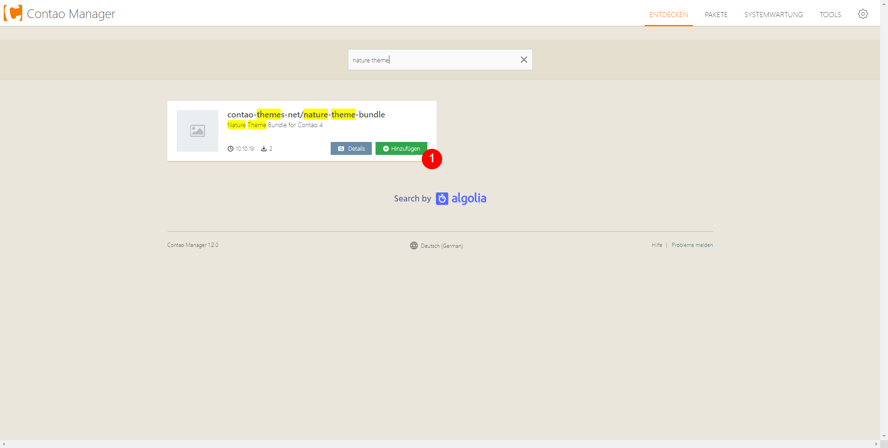
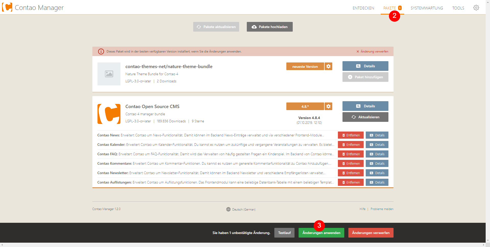
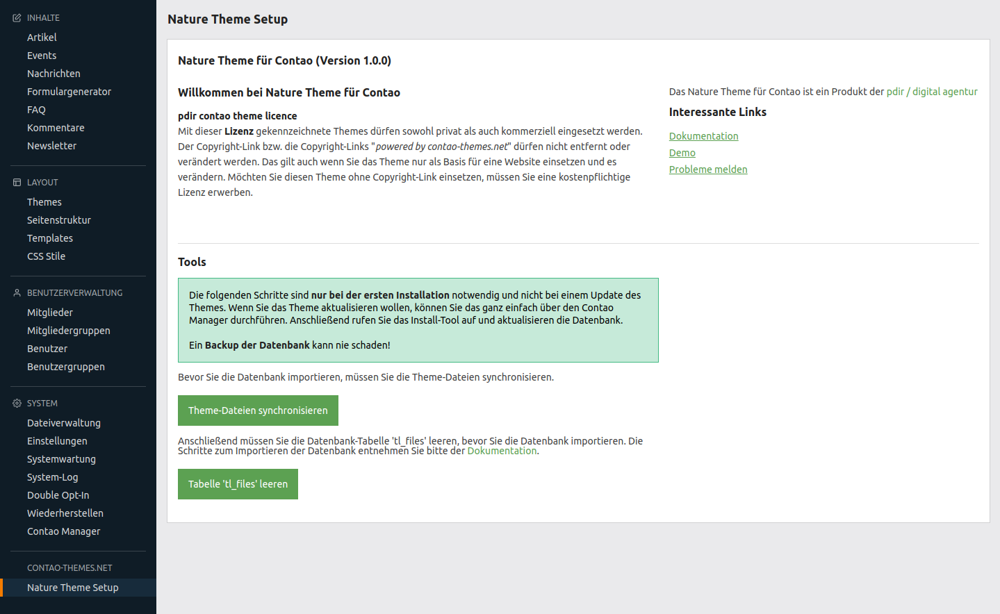
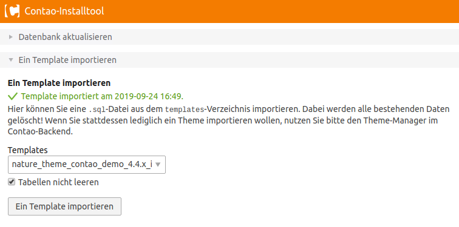
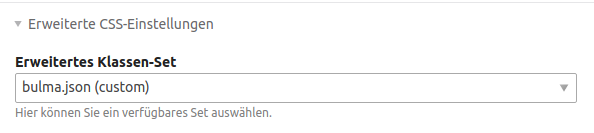

# Installation

## Voraussetzungen

Das Theme kann nur in einer leeren Contao-Installation installiert werden und ist mit Contao 4.4 oder höher kompatibel.

Die folgenden Schritte sind <strong>nur bei der ersten Installation</strong> notwendig und nicht bei einem Update des Themes. Wenn Sie das Theme aktualisieren wollen, können Sie das ganz einfach über den Contao Manager durchführen. Anschließend rufen Sie das Install-Tool auf und aktualisieren die Datenbank.   Ein <strong>Backup der Datenbank</strong> kann nie schaden!

---

## Schritte

### 1 / Nature Theme Bundle installieren

Rufen Sie als erstes den Contao Manager über die folgende URL auf: [www.ihre-domain.de/contao-manager.phar.php](/www.ihre-domain.de/contao-manager.phar.php). Wählen Sie die Schaltfläche **Entdecken** aus und geben im Suchfeld **nature theme** ein. Fügen Sie das Bundle **contao-themes-net/nature-theme-bundle** hinzu, navigieren zum Menüpunkt **Pakete** und klicken ganz unten auf den Button **Änderungen anwenden**. Jetzt sollte die Installation starten.

### 2 / Datenbank aktualisieren

Danach rufen Sie das **Install-Tool** auf und aktualisieren die Datenbank. Im Install-Tool müssen sie noch einen Admin-Benutzeraccount erstellen.

Das Install-Tool erreichen Sie im Contao Manager über den Menüpunkt **Tools** oder über die URL: [www.ihre-domain.de/contao/install](/www.ihre-domain.de/contao/install).

### 3 / Theme Dateien synchronisieren und tl_files leeren

Loggen Sie sich mit Ihrem erstellten Benutzer-Account im Backend ein und wählen Sie in der linken Navigation unter **CONTAO-THEMES-NET** den Menüpunkt **Nature Theme Setup** aus. Anschließend klicken Sie auf den Button **Theme-Dateien synchronisieren**. Damit werden alle Dateien in der Dateiverwaltung unter dem Ordner _naturetheme_ angelegt und die SQL-Dateien zum Importieren der Datenbank in den templates-Ordner kopiert.

Danach müssen die die Datenbank-Tabelle 'tl\_files' leeren, indem Sie auf den Button **Tabelle 'tl\_files' leeren** klicken. Dieser Schritt muss vor dem Importieren der Datenbank erfolgen.

Mit dem Leeren der <strong>tl_files</strong> Tabelle werden die Bilder-Verknüpfungen gelöscht. Das ist nur bei der ersten Installation des Themes notwendig.

### 4 / Datenbank importieren

Rufen Sie nun das Install-Tool auf. Unter dem Reiter "Ein Template importieren" können Sie eine .sql-Datei aus dem templates-Verzeichnis importieren. Wählen Sie die Datei für Ihre Contao-Version aus und aktivieren Sie den Haken **Tabellen nicht leeren**. Anschließend klicken Sie auf **Ein Template importieren**.

Wenn die Datenbank erfolgreich importiert wurde, sollten Sie eine Meldung, dass ein Template importiert wurde, wie im Screenshot zu sehen, erhalten.

### 5 / Symlinks neu erstellen

Anschließend wechseln Sie wieder ins Contao-Backend, wählen den Menüpunkt **Systemwartung** aus und erstellen die Symlinks neu, indem Sie die Checkbox bei **Symlinks neu erstellen** auswählen und anschließend den Button **Daten bereinigen** betätigen.

### 6 / Einstellungen

In den **Einstellungen** müssen Sie unter Frontend-Einstellungen **Auto\_item** und **Ordner-URLs verwenden** aktivieren. Ab Contao 4.7 gibt es die Einstellung Auto_Item aktivieren im Backend nicht mehr, es ist immer standardmäßig aktiv.

Unter **Erweiterte CSS-Einstellungen** müssen SIe noch das Klassen-Set **bulma.json** auswählen.

