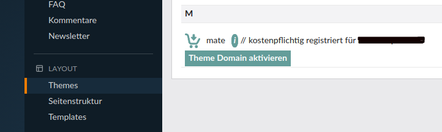

# Lizenz erwerben und registrieren

Das Nature Theme ist kostenlos \(mit Copyright Hinweis\) oder auch kostenpflichtig \(ohne Copyright Hinweis\) erhältlich.

Die kostenpflichtige Lizenz können Sie auf [contao-themes.net](https://contao-themes.net/theme-detail/nature.html) erwerben. Hierfür wählen Sie bitte die Option **ohne Copyright-Hinweis** aus, tragen Ihre gewünschte Domain ein und klicken anschließend den Button **In den Warenkorb**. Gehen Sie danach zur Kasse und folgen Sie den weiteren Schritten.

Nach erfolgreicher Zahlung erhalten Sie von uns per E-Mail eine Rechnung und werden Ihre Domain in Kürze freischalten, sodass Sie diese im Contao Backend registrieren können.

Bis dahin können Sie das Theme jedoch bereits mit Copyright-Hinweis [installieren](nature_theme/installation.md) und verwenden, solange Sie noch keine Lizenz erhalten haben.

#### Lizenz registrieren

Wenn Sie die Theme-Lizenz über <a href="https://themes.contao.org">themes.contao.org</a> bestellt haben, senden Sie uns bitte noch eine E-Mail mit Ihrer <strong>Domain</strong> und dem <strong>bestellten Theme</strong> an <a href="mailto:support@pdir.de">support[AT]pdir.de</a>, damit wir die Theme-Domain-Aktivierung im Backend durchführen können.

Wenn Sie eine Lizenz erworben und das Theme bereits installiert haben, können Sie diese im Backend unter dem Menüpunkt **Themes** registrieren. Klicken Sie auf **Theme Domain aktivieren**, geben Ihre Domain ein und klicken anschließend auf **Check Domain**. Wenn die Domain erfolgreich registriert wurde, sehen Sie eine Meldung mit **Domain registered**. Wenn Sie die Seite neuladen, sollte es wie im folgenden Screenshot aussehen.

Falls Sie nur die Meldung _"You can set a Theme Licence in Layout -> Themes."_ sehen, wenn Sie auf den Button **Theme Domain aktivieren** klicken, dann müssen Sie das **Theme bearbeiten** und im Feld **Theme Code** _nature_ eintragen (siehe folgender Screenshot). Danach sollte das Eingabefeld, um die Domain einzutragen, zu sehen sein.

#### Copyright-Hinweis entfernen

Haben Sie eine Lizenz erworben, können Sie im Contao-Backend den Copyright-Hinweis, der in einem Artikel platziert ist, entfernen.

Navigieren Sie zur **Artikelansicht** und suchen unter **Nature Theme Elemente - 02_Footer** (ganz am Ende) den Artikel **02/03 Copyright-Hinweis** und bearbeiten diesen über das Stift-Icon.

