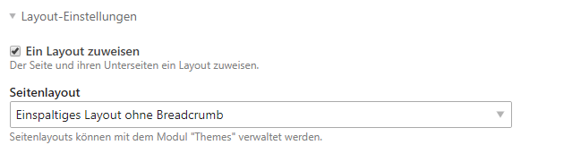
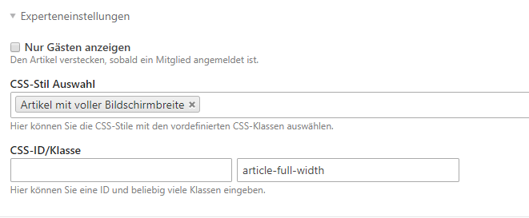

# Maklermodul

Das NATURE Theme liefert bereits Templates und Stylesheets für das [Maklermodul](https://www.maklermodul.de/) mit.

## Dokumentation

In der [Maklermodul-Dokumentation](https://docs.pdir.de/#/maklermodul/index) finden Sie alle Informationen zur 
Installation und Einrichtung des Maklermoduls.

## Stylesheets einbinden

Fügen Sie folgende Zeile in der **custom.scss** (/files/naturetheme/sass) ein, damit die Listen- und Detailansicht 
entsprechend den Screenshots dargestellt wird.

```
@import 'maklermodul';
```

## Einrichtung

### Seiten anlegen

Legen Sie zuerst jeweils eine Seite für die Listen- und Detailansicht an.

### Layout anpassen

Wenn keine Breadcrumb in der Listen- und Detailansicht angezeigt werden soll, können Sie einfach das **einspaltige Layout duplizieren** (unter Themes) und bei **Eingebundene Module** die Breadcrumb entfernen. Anschließend weisen Sie bei den Seiten unter **Layout-Einstellungen** das Layout zu.




### Listenansicht-Modul

Legen Sie ein Modul vom Typ **Immobilienliste** entsprechend der 
[Dokumentation](https://docs.pdir.de/#/maklermodul/einrichtung) an.

* Immobilien-Template **makler_list_nature** auswählen
* Es empfielt sich eine **Bildgröße** zu setzen: z. B. 633 x 390px (entspricht den Bildern in der Demo)


### Detailansicht-Modul

Legen Sie ein Modul vom Typ **Expose** entsprechend der 
[Dokumentation](https://docs.pdir.de/#/maklermodul/einrichtung) an.

* Immobilien-Template **makler_details_extended_nature** auswählen


### Kopfbild-Modul

Legen Sie ein Modul vom Typ **MaklerModul Kopfbild** entsprechend der 
[Dokumentation](https://docs.pdir.de/#/maklermodul/kopfbild_mit_uberschrift) an.


### Platzieren der Module

Platzieren Sie die Module für die Listenansicht und das Exposé unter den jeweiligen Seiten in den Artikeln.

Legen Sie unter der Seite für die Listenansicht einen Artikel für das Kopfbild an. Unter [Elemente](nature_theme/elemente?id=headerbild) finden Sie alle Hinweise zum Anlegen eines Kopfbildes.

Legen Sie unter der Seite für das Exposé ebenfalls einen Artikel für das Kopfbild an und platzieren dort das Modul vom Typ **MaklerModul Kopfbild**.


Bei den Artikeln für das Kopfbild und das Exposé wählen Sie in den Artikeleinstellungen bei CSS-Stil-Auswahl **Artikel mit voller Bildschirmbreite** aus.



## Beispiele

Wenn Sie alle Schritte wie beschrieben durchgeführt haben, sollte die Liste entsprechend den folgenden Screenshots 
dargestellt werden.

### Listenansicht mit Auswahllisten-Filter


### Listenansicht mit Button-Filter


### Exposé


