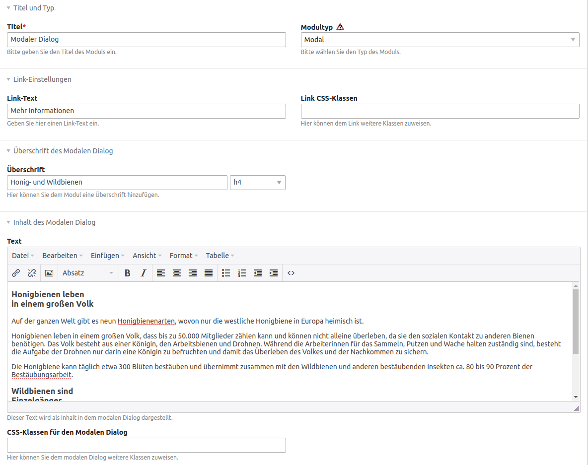
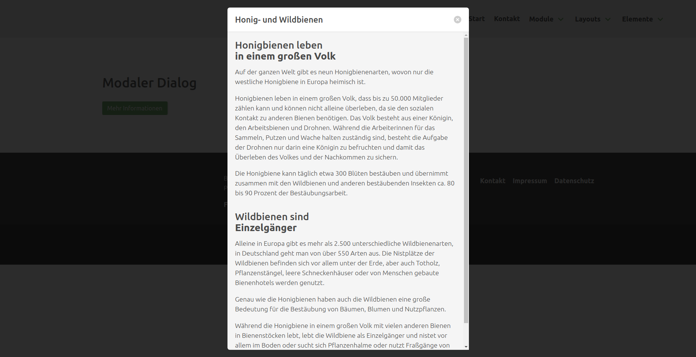

# Module

Auf dieser Seite sind alle Module, die das Theme mitliefert oder anzupassen sind, erklärt und wie Sie diese einsetzen können.

Folgende Module werden auf dieser Seite erklärt:
- [Events](nature_theme/module?id=events)
- [Kalender](nature_theme/module?id=kalender)
- [Modale Dialoge](nature_theme/module?id=modale-dialoge)
- [Navigation](nature_theme/module?id=navigation)
- [News](nature_theme/module?id=news)

## Events

#### Eventliste

**Templates:**
- `event_teaser_nature`: Eventliste mit Bildern und Teaser
- `event_list_nature`: Eventliste nur mit Teaser
- `event_upcoming`: Einfache Auflistung von Events

**Bildgrößen:**
- Events mit Teaser (einspaltiges Layout)
- Events mit Teaser (zweispaltiges Layout)

#### Eventleser

**Templates:**
- `event_full_nature`: Event-Details
- `event_full_nature_header`: Kopfbild

## Kalender

**Templates:**
- `cal_default_nature`: Normaler Kalender
- `cal_mini`: Mini-Kalender

## Modale Dialoge

#### Modul anlegen

Um einen Modalen Dialog zu setzen, navigieren Sie zu den Frontend-Modulen und legen ein neues Modul vom Typ **Modal** an. Dort können Sie einen Link setzen sowie Diesem zusätzliche Klassen vergeben und den eigentlichen Inhalt des Modalen Dialoges bearbeiten. Das Modul können Sie an einer beliebigen Stelle, z. B. im Artikel, einbinden.

#### Beispiel

## Navigation

**Navigationstemplates:**
- `nav_default_nature`: Hauptnavigation
- `nav_default_nature_aside`: Unterseiten-Navigation

**Individuelle Templates:**
- `mod_navigation_nature`: Hauptnavigation
- `mod_navigation_nature_aside`: Unterseiten-Navigation

## News

#### Nachrichtenliste

**Templates:**
- `news_latest_nature_col2`: News-Liste mit Bildern und Teaser (zweispaltig)
- `news_latest_nature_col3`: News-Liste mit Bildern und Teaser (dreispaltig)
- `news_short_nature`: News-Liste nur mit Teaser
- `news_simple`: Einfache Auflistung von News

**Bildgrößen:**
- News / Zweispaltig
- News / Dreispaltig

#### Nachrichtenleser

**Templates:**
- `news_full_nature`: News-Details
- `news_full_nature_header`: Kopfbild