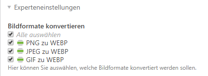

# Pagespeed-Optimierungen

Auf dieser Seite finden Sie ein paar Hinweise zur Optimierung des Pagespeeds.

## Contao Speed Bundle

Um Bilder erst dann zu laden, wenn Sie wirklich sichtbar sind, können Sie z. B. das Contao Speed Bundle von heimrichhannot installieren. Suchen Sie im Contao Manager nach der Erweiterung **heimrichhannot/contao-speed-bundle** und installieren diese. Wie Sie Lazyload bei Bildern aktivieren können, finden Sie in der [Dokumentation](https://github.com/heimrichhannot/contao-speed-bundle).

## Cache aktivieren

folgt ...

## Bilder in WEBP ausliefern

Ab Contao 4.8 haben Sie bei den Bildgrößen die Möglichkeit die Bilder per WEBP auszuliefern. Das können Sie unter **Themes** > **Bildgrößen des Theme bearbeiten** (zweitletztes Icon) > **Einstellungen der Bildgröße bearbeiten** (zweites Icon) unter den **Experten-Einstellungen** einstellen. Beim Demodaten-Import ist dies standardmäßig nicht aktiv, da es nicht bei jedem Hosting-Paket unterstützt wird.

## Bildgrößen verwenden

folgt ...
