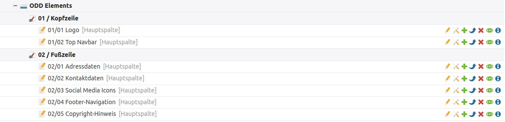
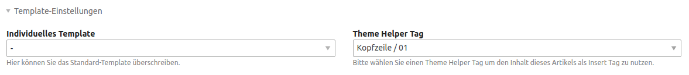
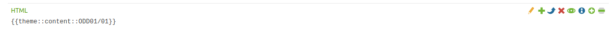

# Einrichtung

## CSS-Anpassungen

Wie Sie Farben und Schriften sowie eigenes CSS definieren können, ist auf der Seite [Variablen](/odd-variablen.md) erklärt.

## JavaScript-Anpassungen

Für eigenes JavaScript legen Sie sich bitte eine eigene Datei an und binden diese im Theme ein.

## Elemente über ein eigenes Insert-Tag platzieren

Unter der Seite **ODD Elements** befinden sich Artikel, die mittels eines Insert-Tags an jeder beliebigen Stelle der Webseite eingebunden werden können. Zu den Artikeln gelangen Sie, indem Sie im linken Menü auf Artikel klicken und ganz nach unten scrollen. 

In den **Artikel-Einstellungen** des jeweiligen Artikels (Werkzeug-Icon\) wählt man dafür unter **Template-Einstellungen** den passenden **Theme Helper Tag** aus.

Den Artikel kann man danach über folgenden Insert-Tag in einem **HTML-Element** oder einem **Template** platzieren: z. B.  `{{theme::content::ODD01/01}}`.

## Header anpassen

Die Inhalte des Headers liegen in den Artikeln unter **ODD Elements** > **01 / Kopfzeile**.

#### Logo anpassen

Das Logo können Sie im Artikel **01/01 Logo** austauschen.

#### Kontaktdaten und Social Media Links anpassen

Die Kontaktdaten sowie die Social Media Links können Sie im Artikel **01/02 Top Navbar** anpassen.

#### Wahl zwischen geraden oder schrägen Header

Wie Sie den geraden Header aktivieren können, wird auf der Seite [Layouts](odd-layouts.md) erklärt.

## Footer anpassen

Die Inhalte des Footer liegen in den Artikeln unter **ODD Elements** > **02 / Fußzeile**. Diese Artikel sind in den Modulen **Footer / Main** und **Footer / Copyright** eingebunden.

