# Elemente

Auf dieser Seite sind alle Contao-Elemente erklärt und wie Sie diese einsetzen können.

## Elemente mit Schrägen

Auf der Seite [Elemente mit Schrägen](http://odd.contao-themes.net/layouts/elemente-mit-schrägen.html) sind bereits diverse Beispiele von Elementen mit Schrägen platziert.

Jeder Bereich muss in einem eigenen Artikel sein, der verschiedene Klassen bekommen muss:

`primary-bg`: Hintergrundfarbe  
`skw-tl`: Schräge nach oben links  
`skw-tr`: Schräge nach oben rechts  
`skw-bl`: Schräge nach unten links  
`skw-br`: Schräge nach unten rechts  

Um dem Artikel beispielsweise Schrägen nach oben rechts und unten links zu vergeben (wie das erste Beispiel auf der Demo-Seite), fügen Sie in den **Artikeleinstellungen** unter **Experten-Einstellungen** die Klassen `primary-bg skw-tr skw-br` hinzu.

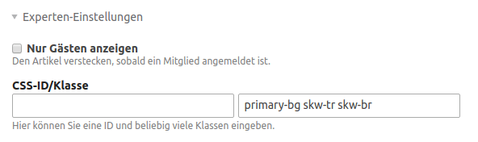

**Hilfe-Tabelle zum Vergeben der Artikel-Klassen:**

| Schräge | Klassen im Artikel | Screenshot |
| ------------- | ------------- | ------------- |
| oben rechts - unten rechts | `primary-bg skw-tr skw-br` | 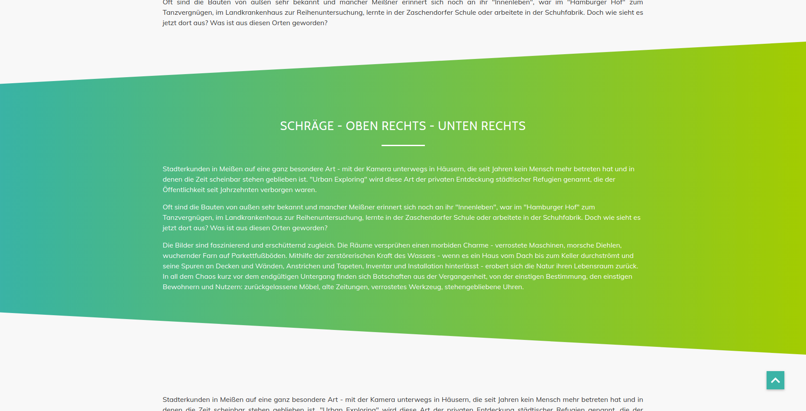 |
| oben links - unten links | `primary-bg skw-tl skw-bl` | 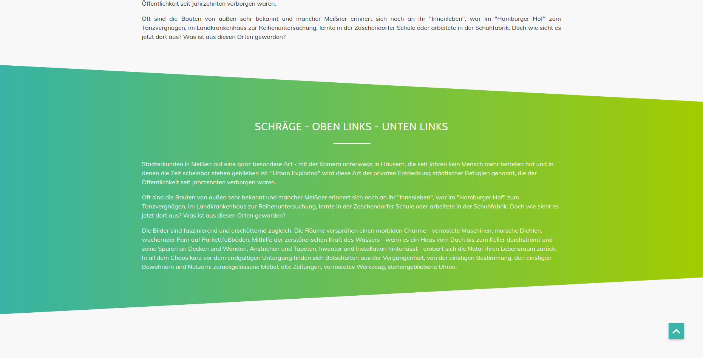 |
| oben links - unten rechts | `primary-bg skw-tl skw-br` | 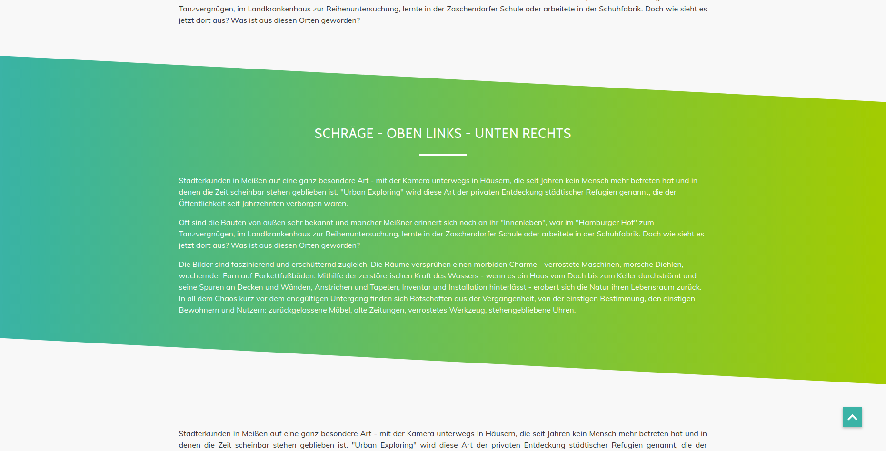 |
| oben rechts - unten links | `primary-bg skw-tr skw-bl` | 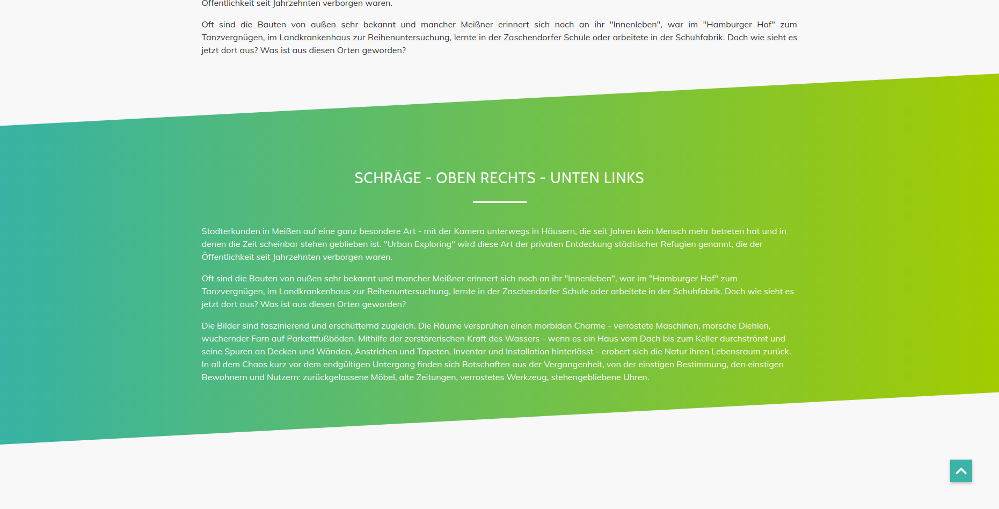 |
| oben rechts | `primary-bg skw-tr` | 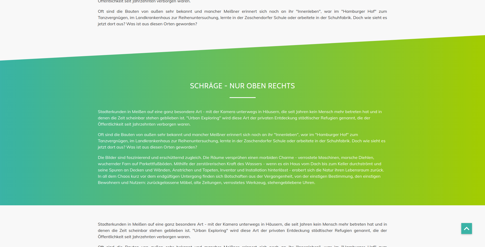  |
| unten rechts | `primary-bg skw-br` | 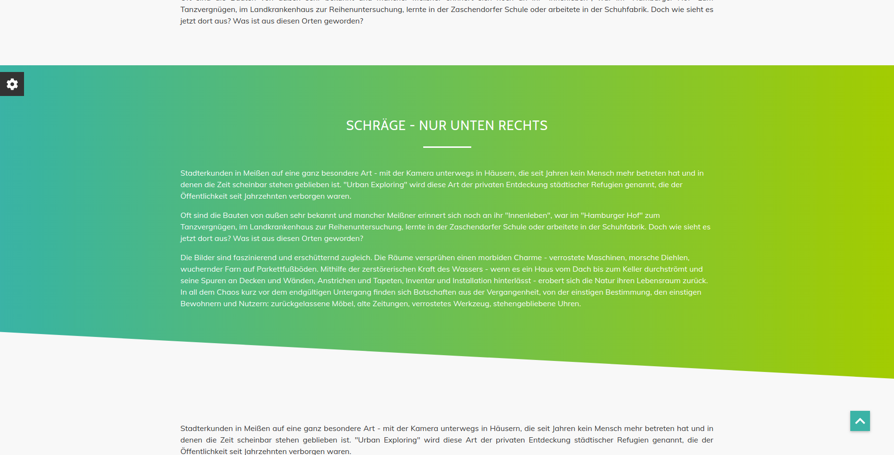  |
| oben links | `primary-bg skw-tl` |  |
| unten links | `primary-bg skw-bl` |  |

## Headerbild

Um ein Headerbild zu platzieren verwenden Sie den Elementtyp **Bild** und fügen unter Template-Einstellungen das Template **ce\_image\_headerimage\_odd** hinzu. 

#### Headerbild ohne Schrägen

Für ein Headerbild ohne Schrägen wählen Sie bei der Bildgröße **Headerbild (1920x400)** aus. Das Headerbild müssen Sie in einem eigenen Artikel platzieren und in den **Artikeleinstellungen** das Template mod\_article\_fullwidth auswählen.

Ein Beispiel finden Sie auf der Seite [Headerbild ohne Schräge](http://odd.contao-themes.net/layouts/headerbild-layouts/ohne-schräge.html).

#### Headerbild mit Schräge nach links

Für ein Headerbild mit einer Schräge nach links wählen Sie bei der Bildgröße **Headerbild (1920x400)** aus. Das Headerbild müssen Sie in einem eigenen Artikel platzieren, in den **Artikeleinstellungen** das Template mod\_article\_fullwidth auswählen und unter **Experten-Einstellungen** die Klasse `skw-bl` hinzufügen.

Ein Beispiel finden Sie auf der Seite [Headerbild mit Schräge nach links](http://odd.contao-themes.net/layouts/headerbild-layouts/schräge-nach-links.html).

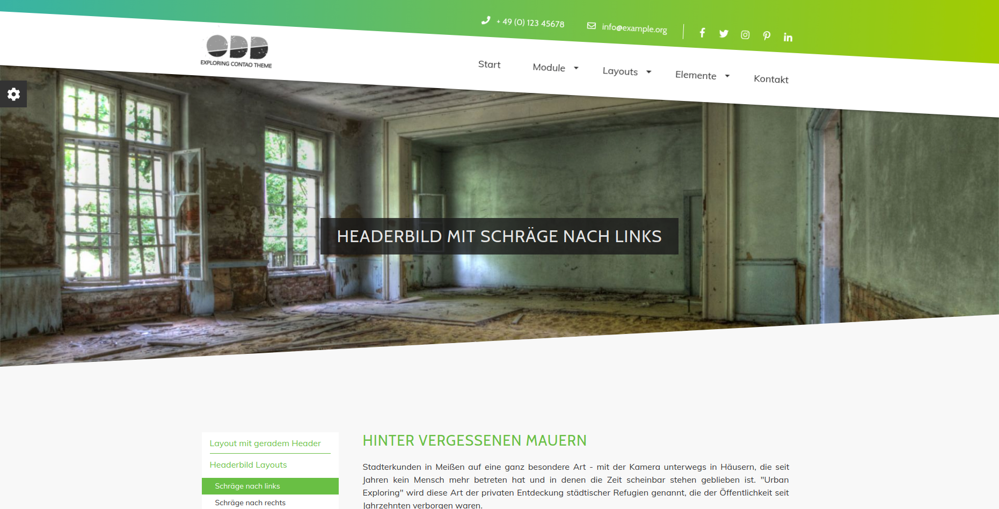

#### Headerbild mit Schräge nach rechts

Für ein Headerbild mit einer Schräge nach rechts wählen Sie bei der Bildgröße **Headerbild (1920x400)** aus. Das Headerbild müssen Sie in einem eigenen Artikel platzieren, in den **Artikeleinstellungen** das Template mod\_article\_fullwidth auswählen und unter **Experten-Einstellungen** die Klasse `skw-br` hinzufügen.

Ein Beispiel finden Sie auf der Seite [Headerbild mit Schräge nach rechts](http://odd.contao-themes.net/layouts/headerbild-layouts/schräge-nach-rechts.html).

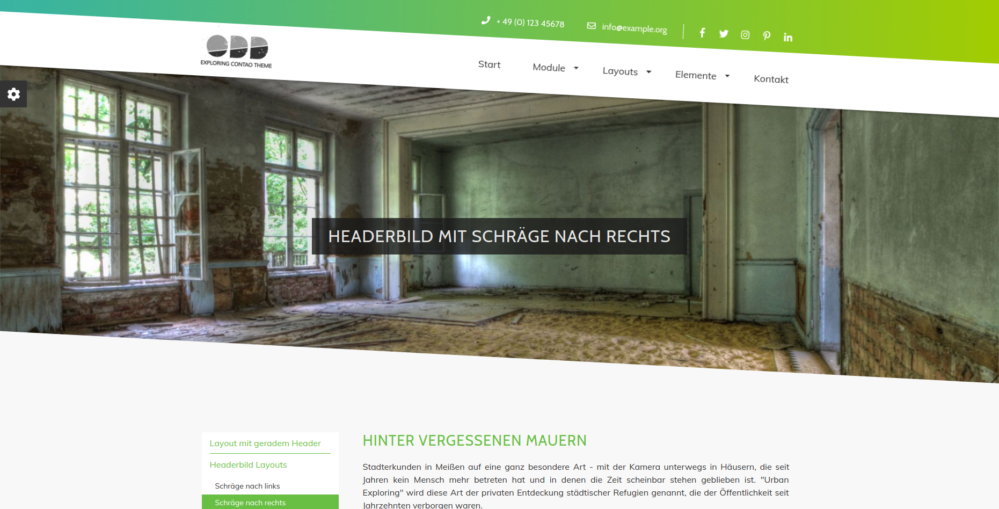

## Überschriften

#### mit Unterstrich linksbündig

Damit die Überschrift linksbündig und mit Unterstrich dargestellt wird, geben Sie dem Textelement die Klasse `bordered-heading`.

#### mit Unterstrich mittig

Damit die Überschrift mittig und mit Unterstrich dargestellt wird, geben Sie dem Textelement die Klasse `bordered-heading` und `text-sm-center`. 

Die Klasse text-sm-center können Sie bei **Erweiterte CSS-Klassen** unter **Ausrichtung** setzen.

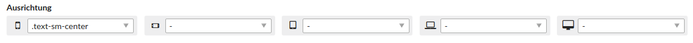

#### mit Unterstrich rechtsbündig

Damit die Überschrift rechtsbündig und mit Unterstrich dargestellt wird, geben Sie dem Textelement die Klasse `bordered-heading` und `text-sm-right`.

Die Klasse text-sm-right können Sie bei **Erweiterte CSS-Klassen** unter **Ausrichtung** setzen.

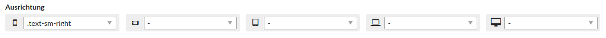

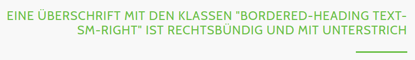

## Hyperlinks

Wenn Sie einem Link die Klasse `btn` geben wird er wie ein Button dargestellt.

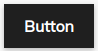

## Content Slider

folgt ...