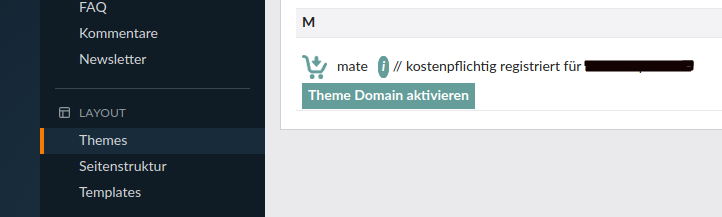
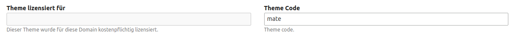

# Lizenz erwerben

Das ODD Theme ist kostenlos \(mit Copyright Hinweis\) oder auch kostenpflichtig \(ohne Copyright Hinweis\) erhältlich. Die detaillierten Lizenzbedingungen des ODD Theme finden Sie [hier](https://github.com/contao-themes-net/odd-theme-bundle/blob/master/LICENSE).

Die kostenpflichtige Lizenz können Sie auf [contao-themes.net](https://contao-themes.net/theme-detail/odd.html) erwerben. Hierfür wählen Sie bitte die Option **ohne Copyright-Hinweis** aus, tragen Ihre gewünschte Domain ein und klicken anschließend den Button **In den Warenkorb**. Gehen Sie danach zur Kasse und folgen Sie den weiteren Schritten.

Nach erfolgreicher Zahlung erhalten Sie von uns per E-Mail eine Rechnung.

Bis dahin können Sie das Theme jedoch bereits mit Copyright-Hinweis [installieren](odd-installation.md) und verwenden, solange Sie noch keine Lizenz erhalten haben.

#### Lizenz registrieren

Wenn Sie eine Lizenz erworben und das ODD Theme bereits installiert haben, können Sie diese im Backend unter dem Menüpunkt **Themes** registrieren. Klicken Sie auf **Theme Domain aktivieren**, geben Ihre Domain ein und klicken anschließend auf **Check Domain**. Wenn die Domain erfolgreich registriert wurde, sehen Sie eine Meldung mit **Domain registered**. Wenn Sie die Seite neuladen, sollte es wie im folgenden Screenshot aussehen.

Falls Sie nur die Meldung _"You can set a Theme Licence in Layout -> Themes."_ sehen, wenn Sie auf den Button **Theme Domain aktivieren** klicken, dann müssen Sie das **Theme bearbeiten** und im Feld **Theme Code** _odd_ eintragen (siehe folgender Screenshot). Danach sollte das Eingabefeld, um die Domain einzutragen, zu sehen sein.

Weiter zur [Installation](odd-installation.md)