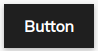
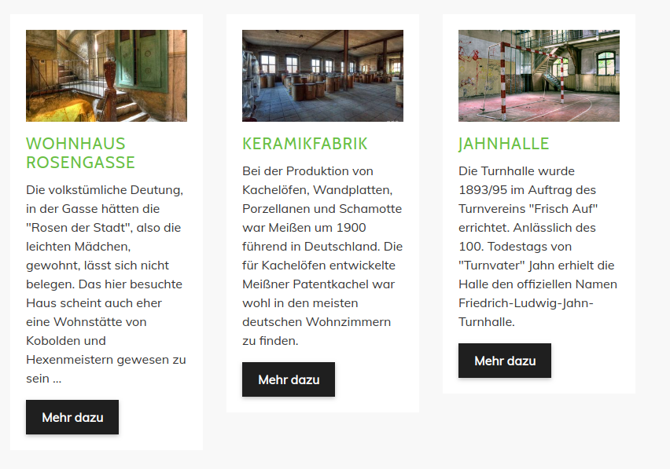
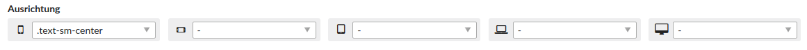
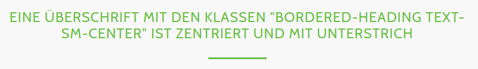

# Elemente

Auf dieser Seite sind alle Elemente erklärt und wie Sie diese einsetzen können.

Folgende Elemente werden auf dieser Seite erklärt:
- [Content-Box](odd_theme/odd-elemente?id=content-box)
- [Content Slider](odd_theme/odd-elemente?id=content-slider)
- [Elemente mit Schrägen](odd_theme/odd-elemente?id=elemente-mit-schrägen)
- [Grid](odd_theme/odd-elemente?id=grid)
- [Headerbild](odd_theme/odd-elemente?id=headerbild)
- [Hyperlinks](odd_theme/odd-elemente?id=hyperlinks)
- [Inhaltsbox](odd_theme/odd-elemente?id=inhaltsbox)
- [Preis-Tabelle](odd_theme/odd-elemente?id=preis-tabelle)
- [Teaserbox](odd_theme/odd-elemente?id=teaserbox)
- [Text mit Icons](odd_theme/odd-elemente?id=text-mit-icons)
- [Überschriften](odd_theme/odd-elemente?id=Überschriften)

## Content-Box

Um eine Content-Box hinzuzufügen, platzieren Sie ein Element vom Typ **Content Box**.

Um mehrere Elemente nebeneinander darzustellen, platzieren Sie diese Elemente wie im Abschnitt [Grid](odd_theme/odd-elemente?id=grid) beschrieben. Ein Beispiel finden Sie in der ODD Demo auf der Seite [Weitere ODD-Elemente](http://odd.contao-themes.net/theme-elemente.html).

## Content Slider

Der Content Slider muss immer in einem **eigenen Artikel**, der in den **Experten-Einstellungen** die Klassen `slider` und `fullwidth` bekommen muss, sein. Wenn der Slider noch eine Schräge nach unten rechts oder links bekommen soll, geben Sie dem Artikel noch die Klasse `skw-br` bzw. `skw-bl`, siehe die untere Tabelle.

Im Artikel platzieren Sie die Elemente **Content-Slider (Umschlag Anfang)** und **Content-Slider (Umschlag Ende)**. Zwischend den Umschlagselementen platzieren Sie jeweils ein Element vom Typ **Slider-Element**.

Das Bild fügen Sie über die Checkbox **Ein Bild hinzufügen** hinzu. Wenn der Slider eine Schräge haben soll, wählen Sie zudem noch die Bildgröße **Slider mit Schräge (1920x900)** aus, bei einem Slider ohne Schräge die Bildgröße **Slider (1920x750)**.

**Hilfe-Tabelle zum Vergeben der Artikel-Klassen:**

| Slider | Klassen im Artikel | Screenshot |
| ------------- | ------------- | ------------- |
| ohne Schräge | `slider fullwidth` |  |
| mit Schräge unten links | `slider fullwidth skw-bl` |  |
| mit Schräge unten rechts | `slider fullwidth skw-br` |  |

Ein Beispiel mit einem platzierten Content-Slider finden Sie auf der Seite [Content-Slider](http://odd.contao-themes.net/inhaltselemente/content-slider.html) oder auf der [Startseite](http://odd.contao-themes.net) der ODD Demo.

## Elemente mit Schrägen

Auf der Seite [Elemente mit Schrägen](http://odd.contao-themes.net/layouts/elemente-mit-schrägen.html) sind bereits diverse Beispiele von Elementen mit Schrägen platziert.

Jeder Bereich muss in einem eigenen Artikel sein, der verschiedene Klassen bekommen muss:

`primary-bg`: Hintergrundfarbe  
`skw-tl`: Schräge nach oben links  
`skw-tr`: Schräge nach oben rechts  
`skw-bl`: Schräge nach unten links  
`skw-br`: Schräge nach unten rechts  

Um dem Artikel beispielsweise Schrägen nach oben rechts und unten links zu vergeben (wie das erste Beispiel auf der Demo-Seite), fügen Sie in den **Artikeleinstellungen** unter **Experten-Einstellungen** die Klassen `primary-bg skw-tr skw-br` hinzu.

**Hilfe-Tabelle zum Vergeben der Artikel-Klassen:**

| Schräge | Klassen im Artikel | Screenshot |
| ------------- | ------------- | ------------- |
| oben rechts - unten rechts | `primary-bg skw-tr skw-br` |  |
| oben links - unten links | `primary-bg skw-tl skw-bl` |  |
| oben links - unten rechts | `primary-bg skw-tl skw-br` |  |
| oben rechts - unten links | `primary-bg skw-tr skw-bl` |  |
| oben rechts | `primary-bg skw-tr` |   |
| unten rechts | `primary-bg skw-br` |   |
| oben links | `primary-bg skw-tl` |  |
| unten links | `primary-bg skw-bl` |  |

## Grid

Das Theme nutzt [Bootstrap 4](https://getbootstrap.com), womit Sie u. a. Elemente ganz einfach nebeneinander und gleichzeitig für mobile Geräte in einer Spalte darstellen können.

Um beispielsweise zwei Textelemente nebeneinander darzustellen, fügen Sie zuerst jeweils ein Element vom Typ **Contao Themes (Inhaltscontainer Anfang)** und **Contao Themes (Inhaltscontainer Ende)** hinzu. Das Element vom Typ **Inhaltscontainer Anfang** muss die Klasse `row` bekommen.

Zwischen den Umschlagselementen platzieren Sie zwei Textelemente, wo Sie jeweils unter **Erweiterte CSS-Klassen** bei **Spaltenbreiten festlegen** `.col-12` und `.col-md-6` auswählen. Das würde bedeuten, dass unter einer Breite von 768px die Elemente einspaltig und darüber zweispaltig dargestellt werden. Wie genau Sie die Klassen verwenden, finden Sie in der [Dokumentation von Bootstrap 4](https://getbootstrap.com/docs/4.0/layout/grid/).

Ein Beispiel finden Sie in der ODD Demo auf der Seite [Textelemente](http://odd.contao-themes.net/inhaltselemente/textelemente.html).

## Headerbild

Um ein Headerbild zu platzieren verwenden Sie den Elementtyp **Bild** und fügen unter Template-Einstellungen das Template **ce\_image\_headerimage\_odd** hinzu. 

#### Headerbild ohne Schrägen

Für ein Headerbild ohne Schrägen wählen Sie bei der Bildgröße **Headerbild (1920x400)** aus. Das Headerbild müssen Sie in einem eigenen Artikel platzieren und in den **Artikeleinstellungen** das Template mod\_article\_fullwidth auswählen.

Ein Beispiel finden Sie auf der Seite [Headerbild ohne Schräge](http://odd.contao-themes.net/layouts/headerbild-layouts/ohne-schräge.html).

#### Headerbild mit Schräge nach links

Für ein Headerbild mit einer Schräge nach links wählen Sie bei der Bildgröße **Headerbild (1920x400)** aus. Das Headerbild müssen Sie in einem eigenen Artikel platzieren, in den **Artikeleinstellungen** das Template mod\_article\_fullwidth auswählen und unter **Experten-Einstellungen** die Klasse `skw-bl` hinzufügen.

Ein Beispiel finden Sie auf der Seite [Headerbild mit Schräge nach links](http://odd.contao-themes.net/layouts/headerbild-layouts/schräge-nach-links.html).

#### Headerbild mit Schräge nach rechts

Für ein Headerbild mit einer Schräge nach rechts wählen Sie bei der Bildgröße **Headerbild (1920x400)** aus. Das Headerbild müssen Sie in einem eigenen Artikel platzieren, in den **Artikeleinstellungen** das Template mod\_article\_fullwidth auswählen und unter **Experten-Einstellungen** die Klasse `skw-br` hinzufügen.

Ein Beispiel finden Sie auf der Seite [Headerbild mit Schräge nach rechts](http://odd.contao-themes.net/layouts/headerbild-layouts/schräge-nach-rechts.html).

## Hyperlinks

Wenn Sie einem Link die Klasse `btn` geben wird er wie ein Button dargestellt.

## Inhaltsbox

Wenn Sie bei einem **Textelement** unter den **Template-Einstellungen** das Template **ce_text_cthemes_simplebox** auswählen, wird es wie im folgenden Screenshot mit einem weißen Hintergrund versehen.

Um mehrere Elemente nebeneinander darzustellen, platzieren Sie diese Elemente wie im Abschnitt [Grid](odd_theme/odd-elemente?id=grid) beschrieben. Ein Beispiel finden Sie in der ODD Demo auf der Seite [Weitere ODD-Elemente](http://odd.contao-themes.net/theme-elemente.html).

## Preis-Tabelle

Um eine Preis-Tabelle darzustellen, platzieren Sie ein Element vom Typ **Preis-Tabelle**.

Um eine Box hervorgehoben darzustellen, füllen Sie das Eingabefeld **Bezeichnung für Hervorgehobene Box** aus. Um mehrere Elemente nebeneinander darzustellen, platzieren Sie diese Elemente wie im Abschnitt [Grid](odd_theme/odd-elemente?id=grid) beschrieben. Zwei Beispiele finden Sie in der ODD Demo auf der Seite [Weitere ODD-Elemente](http://odd.contao-themes.net/theme-elemente.html).

## Teaserbox

Um eine Teaser-Box hinzuzufügen, platzieren Sie ein Element vom Typ **Teaser Box**.

Das Bild fügen Sie über die Checkbox **Ein Bild hinzufügen** hinzu. Wählen Sie dazu die Bildgröße **Teaserboxen (350x200)** aus.

Um mehrere Elemente nebeneinander darzustellen, platzieren Sie diese Elemente wie im Abschnitt [Grid](odd_theme/odd-elemente?id=grid) beschrieben. Ein Beispiel finden Sie in der ODD Demo auf der Seite [Weitere ODD-Elemente](http://odd.contao-themes.net/theme-elemente.html).

## Text mit Icon

Platzieren Sie ein Element vom Typ **Text und Icon**.

Sie können eine Überschrift, einen Text sowie das Font-Awesome Icon und ggf. einen Link definieren. Eine Liste mit den möglichen Icons finden Sie auf der Seite von [Font Awesome](https://fontawesome.com/icons?d=gallery&m=free). Wenn Sie ein Icon anklicken, sehen Sie oben auch die Klassen, die Sie in das Eingabefeld **Font Awesome 5 Icon (Klassen)** einfügen müssen.

Ein Beispiel finden Sie in der ODD Demo auf der Seite [Weitere ODD-Elemente](http://odd.contao-themes.net/theme-elemente.html).

## Überschriften

Beispiele wo die Überschriften platziert sind, finden Sie auf der Seite [Textelemente](http://odd.contao-themes.net/inhaltselemente/textelemente.html).

#### mit Unterstrich linksbündig

Damit die Überschrift linksbündig und mit Unterstrich dargestellt wird, geben Sie dem Textelement die Klasse `bordered-heading`.

#### mit Unterstrich mittig

Damit die Überschrift mittig und mit Unterstrich dargestellt wird, geben Sie dem Textelement die Klasse `bordered-heading` und `text-sm-center`. 

Die Klasse text-sm-center können Sie bei **Erweiterte CSS-Klassen** unter **Ausrichtung** setzen.

#### mit Unterstrich rechtsbündig

Damit die Überschrift rechtsbündig und mit Unterstrich dargestellt wird, geben Sie dem Textelement die Klasse `bordered-heading` und `text-sm-right`.

Die Klasse text-sm-right können Sie bei **Erweiterte CSS-Klassen** unter **Ausrichtung** setzen.

