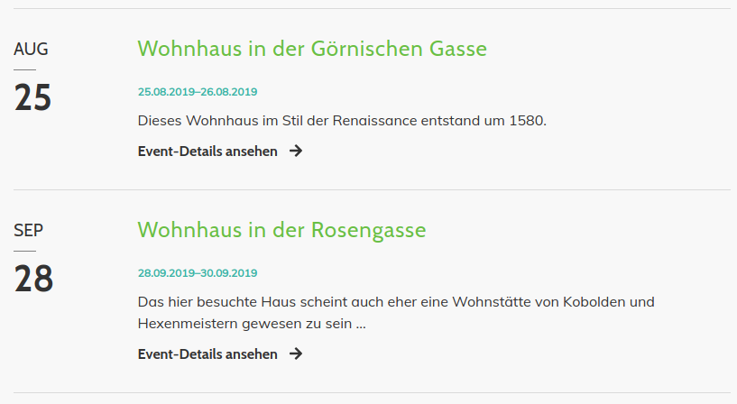

# Module

Auf dieser Seite sind alle Module erklärt und wie Sie diese einsetzen können.

Folgende Module werden auf dieser Seite erklärt:
- [Events](odd_theme/odd-module?id=events)
- [FAQ](odd_theme/odd-module?id=faq)
- [Kalender](odd_theme/odd-module?id=kalender)
- [Modale Dialoge](odd_theme/odd-module?id=modale-dialoge)
- [Navigation](odd_theme/odd-module?id=navigation)
- [News](odd_theme/odd-module?id=news)

## Events

#### Eventliste mit Bildern

Für eine Eventliste mit Bildern, wie sie in der [ODD Demo](http://odd.contao-themes.net/module/events.html) dargestellt wird, wählen Sie das Template **event_teaser_odd** aus. Wählen Sie auch noch die Bildgröße **News / Listenansicht (540x350)** aus.

  

#### Eventliste ohne Bilder

Für eine Eventliste ohne Bilder, wie sie in der [ODD Demo](http://odd.contao-themes.net/module/events.html) dargestellt wird, wählen Sie das Template **event_list_odd** aus.

  

#### Einfache Eventliste

Für eine einfache Eventliste, wie sie in der [ODD Demo](http://odd.contao-themes.net/module/events.html) dargestellt wird, wählen Sie das Template **event_upcoming** aus.

   

  

#### Detailansicht

Für die Detailansicht wählen Sie das Template **event_full_odd** aus.

Um das Eventbild als Kopfbild anzuzeigen, platzieren Sie einen weiteren Eventleser im Kopfbereich mit dem Template **event_full_header_odd** und der Bildgröße **Headerbild mit Schräge (1920x650)**.

Ein Beispiel für eine Events-Detailansicht mit Kopfbild finden Sie in der [ODD Demo](http://odd.contao-themes.net/event-details/wohnhaus-in-der-g%C3%B6rnischen-gasse.html).

## FAQ

Damit die FAQ-Seite als Akkordion dargestellt wird, wählen Sie bei den Template-Einstellungen das Template **mod_faqpage_odd** aus. Ein Beispiel finden Sie in der ODD Demo auf der Seite [FAQ](http://odd.contao-themes.net/module/faq.html).

   

## Kalender

#### Normaler Kalender

Für einen normalen Kalender, wie er in der [ODD Demo](http://odd.contao-themes.net/module/events.html) dargestellt wird, wählen Sie das Template **cal_default_odd** aus.

  
   

#### Mini-Kalender

Für einen Mini-Kalender, wie er in der [ODD Demo](http://odd.contao-themes.net/module/events.html) dargestellt wird, wählen Sie das Template **cal_mini** aus.

  
   

## Modale Dialoge

Um einen [Modalen Dialog](https://getbootstrap.com/docs/4.0/components/modal/) zu setzen, navigieren Sie zu den Frontend-Modulen und legen ein neues Modul vom Typ **Modal** an. Dort können Sie einen Link setzen sowie Diesem zusätzliche Klassen vergeben und den eigentlichen Inhalt des Modalen Dialoges bearbeiten. Das Modul können Sie an einer beliebigen Stelle, z. B. im Artikel, einbinden.

Wenn der Modale Dialog vertikal zentriert sein soll, fügen Sie im Feld **CSS-Klassen für den Modalen Dialog**
 die Klasse `modal-dialog-centered` ein. Um den Modalen Dialog breiter darzustellen, können Sie in dem gleichen Eingabefeld die Klasse `modal-lg` eintragen.
 
 

## Navigation

#### Gerade Navigation

Auf der Seite [Layouts](odd_theme/odd-layouts.md) ist beschrieben wie Sie zu einem geraden Header gelangen.

#### Unterseiten-Navigation

Für eine Unterseiten-Navigation, wie Sie in der ODD Demo auf der Seite [Navigation](http://odd.contao-themes.net/module/navigation.html) dargestellt wird, erstellen Sie ein Modul vom Typ **Navigationsmenü** und geben dem Modul die Klasse `subnav`.

## News

#### Newsliste mit Bildern

Für eine Newsliste mit Bildern, wie sie in der [ODD Demo](http://odd.contao-themes.net/news.html) dargestellt wird, wählen Sie das Template **news_latest_odd** aus. Wählen Sie auch noch die Bildgröße **News / Listenansicht (540x350)** aus. Damit die Elemente nebeneinander dargestellt werden, müssen Sie dem Modul noch die Klasse `row` geben.

  

#### Newsliste ohne Bilder

Für eine Newsliste ohne Bilder, wie sie in der [ODD Demo](http://odd.contao-themes.net/news.html) dargestellt wird, wählen Sie das Template **news_short_odd** aus. Wählen Sie auch noch die Bildgröße **News / Listenansicht (540x350)** aus. Damit die Elemente nebeneinander dargestellt werden, müssen Sie dem Modul noch die Klasse `row` geben.

  

#### Einfache Newsliste

Für eine einfache Newsliste, wie sie in der [ODD Demo](http://odd.contao-themes.net/news.html) dargestellt wird, wählen Sie das Template **news_simple** aus. Wählen Sie auch noch die Bildgröße **News / Listenansicht (540x350)** aus.

  

#### Detailansicht

Für die Detailansicht wählen Sie das Template **news_full_odd** aus.

Um das Newsbild als Kopfbild anzuzeigen, platzieren Sie einen weiteren Newsleser im Kopfbereich mit dem Template **news_full_header_odd** und der Bildgröße **Headerbild mit Schräge (1920x650)**.

Ein Beispiel für eine News-Detailansicht mit Kopfbild finden Sie in der [ODD Demo](http://odd.contao-themes.net/news-details/wohnhaus-in-der-rosengasse.html).