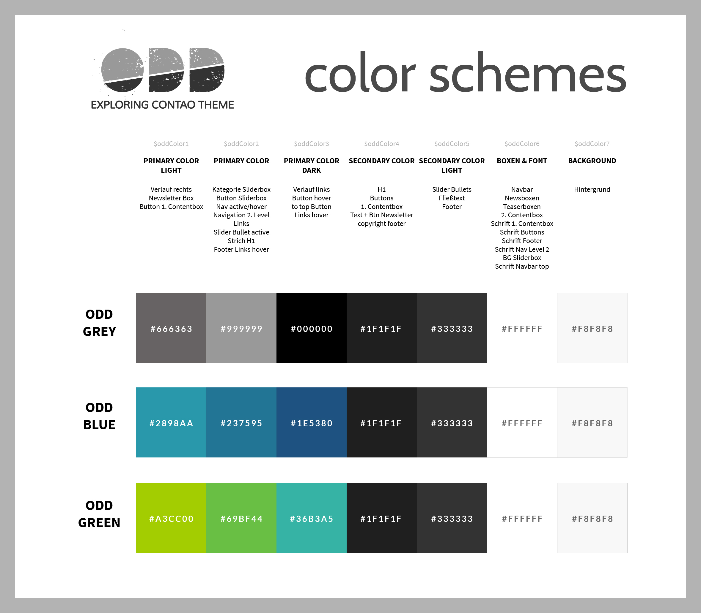

# Variablen

Wenn das Theme erfolgreich installiert wurde, befinden sich die [SCSS](https://sass-lang.com/documentation/file.SASS_REFERENCE.html)-Dateien in der Dateiverwaltung unter dem Pfad **odd/scss**. Für individuelle Anpassungen nutzen Sie einfach die **custom.scss**, in der Sie sowohl SCSS oder auch normales CSS schreiben können, sowie die **\_custom\_colors.scss** und **\_custom\_variables.scss**.

In der **\_custom\_colors.scss** können Sie die Grundfarben des Themes verändern und ein anderes Farbschema auswählen. Wenn Sie eine Variable anpassen möchten, müssen Sie die Zeile auskommentieren (Schrägstriche entfernen).

In der **\_custom\_variables.scss** können Sie individuellere Anpassungen vornehmen, u. a. Schriften austauschen, die Schriftgrößen der Überschriften beeinflussen oder Farben von Elementen und Modulen anpassen. Wenn Sie eine Variable anpassen möchten, müssen Sie die Zeile auskommentieren (Schrägstriche entfernen).

Wenn Sie lieber mit CSS-Dateien statt mit SCSS-Dateien arbeiten wollen, können Sie über **Themes - Stylesheets** einen neuen Stylesheet anlegen und ihn im **Layout** bei **Interne Stylesheets** einbinden. Das CSS wird anschließend automatisch nach dem CSS des ODD Theme geladen.

## Farbschemen

Das ODD Theme wird standardmäßig mit einem grünen Layout ausgeliefert. Sie haben aber auch die Möglichkeit ein graues oder blaues Farbschema auszuwählen.

Wenn Sie auf ein Layout umstellen wollen, kommentieren Sie in der **\_custom\_colors.scss** die entsprechende Zeile bei **Colour Schemes** aus \(Schrägstriche entfernen\). Gegebenenfalls müssen Sie die Seite mit Strg + F5 neuladen, damit die Änderung greift.

## Variablen der \_custom\_colors.scss

#### Grundfarben:

**$oddColor1:** Hauptfarbe helle Abstufung  
**$oddColor2:** Hauptfarbe  
**$oddColor3:** Hauptfarbe dunkle Abstufung  
**$oddColor4:** Sekundärfarbe  
**$oddColor5:** Sekundärfarbe helle Abstufung  
**$oddColor6:** Boxen und Schrift  
**$oddColor7:** Seiten-Hintergrund 
