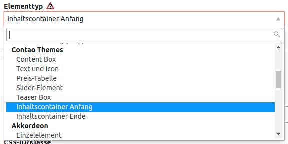

# Elemente

Im Folgenden werden alle Elemente des 0.1 Themes einzeln erläutert und zudem wird beschrieben, wie genau Sie diese 
einsetzen können.

Folgende Elemente werden auf dieser Seite vorgestellt:
- [Buttons](zeroone_theme/elemente?id=buttons)
- [Formulare](zeroone_theme/elemente?id=formulare)
- [Grid](zeroone_theme/elemente?id=grid)
- [Media-Elemente](zeroone_theme/elemente?id=media-elemente)
- [Parallax](zeroone_theme/elemente?id=parallax)
- [Tabellen](zeroone_theme/elemente?id=tabellen)
- [Tabs](zeroone_theme/elemente?id=tabs)
- [Teaserbox](zeroone_theme/elemente?id=teaserbox)
- [Überschriften](zeroone_theme/elemente?id=Überschriften)
- [Zitat](zeroone_theme/elemente?id=zitat)

## Buttons

Um einen Button zu platzieren befolgen Sie folgende Schritte:

* Elementtyp **Hyperlink** auswählen
* Linkadresse/Linktext vergeben (Hyperlink-Einstellungen)
* Individuelles Template `ce_hyperlink_button_zeroone` auswählen (Template-Einstellungen)

Unter dem Reiter **Erweiterte CSS-Klassen** können Sie bei **Button-Style** (unter Klassen für Inhaltselemente) noch 
weitere Klassen vergeben, um das Aussehen des Buttons zu beeinflussen: _.btn-primary_, _.btn-link_, _.btn-success_, 
_.btn-error_.

Bei Button-Größe können Sie die Größe des Buttons anpassen: _.btn-sm_ (klein), _.btn-lg_ (groß).

Bei Button Fullwidth kann der Button über die gesamte verfügbare Breite dargestellt werden: _.btn-block_.

## Formulare

Wenn Sie ein Formular anlegen, müssen Sie in den **Formulareinstellungen** unter **Template-Einstellungen** das 
Formulartemplate `form_wrapper_zeroone` auswählen.

Desweiteren bringt das 0.1 Theme weitere Templates für Formularfelder mit, die Sie bei den jeweiligen Elementen 
unter Template-Einstellungen auswählen müssen, wenn die Felder wie in der Theme-Demo dargestellt werden sollen.

**Checkbox-Menü:**
* `form_checkbox_zeroone`: Darstellung untereinander
* `form_checkbox_inline_zeroone`: Darstellung nebeneinander

**Radio-Button-Menü:**
* `form_radio_zeroone`: Darstellung untereinander
* `form_radio_inline_zeroone`: Darstellung nebeneinander

**Absendefeld:**
* `form_submit_zeroone`

## Grid

Das Theme basiert auf [Spectre CSS](https://picturepan2.github.io/spectre/layout/grid.html), womit Sie u. a. 
Elemente ganz einfach nebeneinander und gleichzeitig für mobile Geräte in einer Spalte darstellen können.

#### Platzieren des Inhaltscontainers

Um beispielsweise zwei Textelemente nebeneinander darzustellen, fügen Sie zuerst jeweils ein Element vom Typ **Contao 
Themes (Inhaltscontainer Anfang)** und Contao Themes **(Inhaltscontainer Ende)** hinzu.

Das Element vom Typ **Inhaltscontainer Anfang** muss unter **Erweiterte CSS-Klassen** das Col-Attribut `.columns` 
bekommen.

#### Platzieren der Inhaltselemente

Zwischen den Umschlagselementen platzieren Sie die Elemente, die Sie nebeneinander darstellen möchten. Dabei müssen 
Sie unter Erweiterte CSS-Klassen das Col-Attribut .column auswählen.

Zusätzlich können Sie auch noch weitere Klassen definieren, u. a. Spaltenbreiten für bestimmte Auflösungen oder  
Spalten-Abstände. Weitere Informationen finden Sie in der Spectre-Dokumentation unter 
[Flexbox-Grid](https://picturepan2.github.io/spectre/layout/grid.html) und 
[Responsive](https://picturepan2.github.io/spectre/layout/responsive.html).

#### Beispiel

## Media-Elemente

#### Download(s)

* Elementtyp **Download** oder **Downloads** auswählen
* Einstellungen vornehmen
* Individuelles Template `ce_download_zeroone` bzw. `ce_downloads_zeroone` auswählen (Template-Einstellungen)

#### Galerie

* Elementtyp **Galerie** auswählen
* Einstellungen vornehmen
* Individuelles Template `ce_gallery_zeroone` auswählen (Template-Einstellungen)

#### YouTube-Video

* Elementtyp **YouTube** auswählen
* Einstellungen vornehmen
* Individuelles Template `ce_youtube_zeroone` auswählen (Template-Einstellungen)

## Parallax

Legen Sie für ein Parallax-Element einen neuen Artikel an, bearbeiten Sie die Artikel-Einstellungen und geben unter den 
Experten-Einstellungen folgende CSS-Klassen an (zweites Eingabefeld): `hero parallax fullwidth`.

In dem Artikel platzieren Sie ein **Textelement** und fügen bei Text z. B. eine Überschrift sowie einen Text ein. Unter den 
Bild-Einstellungen können Sie das Bild auswählen.

Unter **Template-Einstellungen** wählen Sie noch das Template `ce_text_hero_parallax_zeroone` aus.

So sollte das fertige Parallax-Element aussehen:

## Tabellen

Um eine Tabelle zu platzieren befolgen Sie folgende Schritte:

* Elementtyp **Tabelle** auswählen
* Tabelleneinträge definieren
* Individuelles Template `ce_table_zeroone` auswählen (Template-Einstellungen)

Unter **Experten-Einstellungen** können Sie in dem zweiten Eingabefeld noch weitere **CSS-Klassen** definieren, um das 
Aussehen der Tabelle zu beeinflussen:

* `table-striped`: Gestreifte Tabelle
* `table-hover`: Hover-Effekt
* `table-scroll`: Scrollbare Tabelle

## Tabs

Für ein Tabs-Element platzieren Sie zuerst jeweils ein Element vom Typ **Inhaltscontainer Anfang** und 
**Inhaltscontainer Ende**. 

Bei dem Element **Inhaltscontainer Anfang** tragen Sie bei **Experten-Einstellungen** in dem zweiten Eingabefeld die 
Klasse `tabs` ein.

Anschließend platzieren Sie innerhalb der Inhaltscontainer ein Element vom Typ **Tabs-Reiter**.

In dem Element **Tabs-Reiter** können Sie unter **Tabs-Einstellungen** die einzelnen Reiter definieren. Geben Sie immer 
einen eindeutigen Wert und eine Bezeichnung ein.

Nach dem Tabs-Reiter-Element fügen Sie jeweils ein Element vom Typ **Tabs-Umschlag (Start)** und 
**Tabs-Umschlag (Stop)** ein.

Innerhalb der Tab-Umschlagselemente fügen Sie die jeweiligen Inhalte als **Textelemente** ein. Bei den 
**Experten-Einstellungen** muss als **CSS-Klasse** der jeweilige **Wert** aus dem Tabs-Reiter-Element eingetragen 
werden.

So sollte es am Ende aussehen:

## Teaserbox

Um eine Teaserbox zu platzieren befolgen Sie folgende Schritte:

* Elementtyp **Teaser Box** (unter Contao Themes) auswählen
* Überschrift und Text einfügen, Link-Adresse/-Text unter den Teaser-Box-Einstellungen ausfüllen
* Individuelles Template `ce_cthemes_teaserbox_zeroone` auswählen (Template-Einstellungen)

Standardmäßig wird die Teaserbox dann wie im folgenden Screenshot dargestellt:

Sie können zusätzlich auch noch ein Bild hinzufügen, wenn Sie unter **Bild-Einstellungen** den Haken 
**Ein Bild hinzufügen** auswählen. Bei **Bildausrichtung** können Sie wählen ob Sie das Bild links- oder rechtsbündig 
darstellen wollen. 

Eine Teaserbox mit Bild wird dann wie in den folgenden Screenshots dargestellt.

  

## Überschriften

#### Farbe und Größe ändern

* Elementtyp **Überschrift** auswählen
* Unter Experten-Einstellungen können verschiedene CSS-Klassen vergeben werden (zweites Eingabefeld):
  * `primary-color-dark`: Überschrift in dunkler Hauptfarbe
  * `primary-color-light`: Überschrift in heller Hauptfarbe
  * `headline-35`: Überschrift ist immer 35px groß

#### Ausrichtung ändern

Unter Erweiterte CSS-Klassen können Sie bei Textausrichtung (unter Klassen für Inhaltselemente) die Ausrichtung der 
Überschrift ändern. Sie können folgende Klassen auswählen:

* `text-left`: Linksbündige Ausrichtung
* `text-center`: Zentrierte Ausrichtung
* `text-right`: Rechtsbündige Ausrichtung
* `text-justify`: Blocksatz

#### Überschriften mit Punkten

* Elementtyp **Überschrift** auswählen
* Individuelles Template `ce_headline_zeroone` auswählen
* Unter **Experten-Einstellungen** die CSS-Klasse `headline-dotted` einfügen (zweites Eingabefeld)

  

So würde die Überschrift dann aussehen:

## Zitat

Legen Sie für ein Zitat-Element einen neuen Artikel an, bearbeiten Sie die Artikel-Einstellungen und geben unter den 
Experten-Einstellungen folgende CSS-Klassen an (zweites Eingabefeld): `hero quote text-center`.

In dem Artikel platzieren Sie ein **Textelement** und fügen eine Überschrift ein. 

Das Feld Text müssen Sie nicht ausfüllen, da es nicht ausgegeben wird. Da dies ein Pflichtfeld ist reicht es, wenn 
Sie z. B. nur eine leere Zeile dort einfügen.

Unter den **Bild-Einstellungen** können Sie das Bild, das im Hintergrund dargestellt wird, auswählen.

Unter Erweiterte CSS-Klassen müssen Sie noch folgende Einstellungen vornehmen:

* `.column` bei **Col-Attribut hinzufügen** auswählen
* `.col-mx-auto` bei **Offset (Abstand)** auswählen

So sollte das fertige Zitat-Element aussehen:

