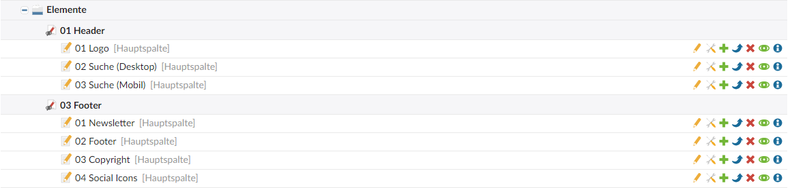
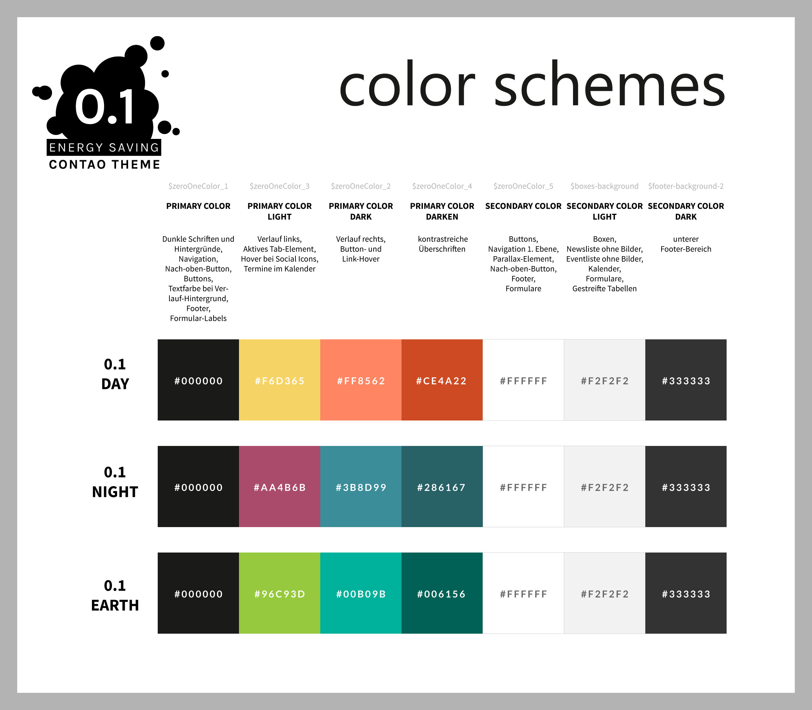

# Theme anpassen

## Header und Footer

Die Inhalte des Headers können Sie in den Artikeln unter **Elemente** > **01 Header** bearbeiten.

Die Inhalte des Footers können Sie in den Artikeln unter **Elemente** > **03 Footer** bearbeiten.



## Kontaktformular

Wenn Sie die Anfragen des Kontaktformulars per E-Mail erhalten möchten, wählen Sie in der linken Navigation 
**Formulargenerator** aus und bearbeiten die Einstellungen des Formulars (das zweite Icon). Unter 
**Formulardaten versenden** tauschen Sie anschließend die E-Mail-Adresse aus.

## Styling anpassen

Wenn das Theme erfolgreich installiert wurde, befinden sich die SCSS-Dateien in der Dateiverwaltung unter dem Pfad 
**zeroOne/scss**. Für individuelle Anpassungen nutzen Sie einfach die **custom.scss**, in der Sie sowohl SCSS als auch 
normales CSS schreiben können, und die **_custom_variables.scss**.

In der **_custom_variables.scss** können Sie die Farben und die Schriftart des Themes verändern und ein anderes 
Farbschema auswählen. Wenn Sie eine Variable anpassen möchten, müssen Sie die Zeile entkommentieren 
(Schrägstriche entfernen).

Wenn Sie lieber mit CSS-Dateien statt mit SCSS-Dateien arbeiten wollen, können Sie über Themes - Stylesheets einen 
neuen Stylesheet anlegen und ihn im Layout bei Interne Stylesheets einbinden. Das CSS wird anschließend automatisch 
nach dem CSS des Theme geladen.

### Farbschemen

Das 0.1 Theme wird standardmäßig mit einem hellen Layout in orangenen/gelben Farben ausgeliefert. Sie haben aber die
Möglichkeit andere Farbschemen zu aktivieren:

* Helles Farbschema - Orange/Gelb (DAY)
* Helles Farbschema - Grün/Blau (EARTH)
* Helles Farbschema - Rot/Blau (NIGHT)

Um zu einem anderen Layout zu wechseln, entkommentieren (Schrägstriche entfernen) Sie bitte in der Datei 
**_custom_variables.scss** im Abschnitt **Colour Schemes** die Zeile mit dem gewünschten Farbschema. Gegebenenfalls ist 
es nötig, die Seite im Browser mit Strg + F5 neuzuladen, damit die Änderungen wirksam werden.

Beispiel um das EARTH Farbschema zu aktivieren:

```
@import '/colour_schemes/earth';
//@import '/colour_schemes/night';
```



#### Dark Mode

Viele Geräte / Apps bieten mittlerweile die Möglichkeit einen Dark Mode bzw. Dunkelmodus zu aktivieren, der die 
Benutzeroberfläche dunkel und den Text zur besseren Lesbarkeit hell darstellt. Wird der Dark Mode aktiviert, wechselt 
das 0.1 Theme automatisch zu einem dunkleren Farbschema, egal welches Farbschema Sie gerade aktiviert haben. Dies hat 
den Vorteil, dass die Augen weniger belastet werden und auch die Akkulaufzeit lässt sich durch die geringere 
Beleuchtungsenergie verbessern.

Sie können den Dark Mode auf Wunsch jedoch auch deaktivieren, indem Sie in der **_custom_variables.scss** die folgende 
Zeile auskommentieren (zwei Schrägstriche an den Anfang der Zeile setzen):

```
//@import '/colour_schemes/dark_mode';
```

#### Automatische Anpassung von Bildern an das Farbschema

Im 0.1 Theme werden die Bilder von News, Events und dem Parallax-Element per CSS-Bildfilter automatisch farblich an das 
gewählte Farbschema angepasst. Im Farbschema DAY erscheinen Bilder also gelb/orange, während im Schema NIGHT ein 
violetter Filter über den Bildern liegt. Mit diesen Farbfiltern kann jedes beliebige Bild eingefärbt werden, indem Sie 
das entsprechende Bild-Element mit der Klasse **css-filter** versehen.

Die automatischen Farbfilter lassen sich jedoch auch deaktivieren. Kommentieren Sie hierzu in der Datei 
**_custom_variables.scss** die folgende Zeile aus (zwei Schrägstriche an den Anfang der Zeile setzen).

Dieses Feature wird in allen aktuellen Browsern (außer Internet Explorer) unterstützt.

```
//@import '/colour_schemes/adjust_images';
```

#### Variablen

Um Farben und die Schriftart anzupassen kommentieren Sie in der **_custom_variables.scss** die entsprechenden Zeilen 
aus (Schrägstriche entfernen).

| Variable | Bedeutung |
| ------------- | ------------- |
| $body-font-family | Schriftart |
| $zeroOneColor_1 | Dunkle Schriften und Hintergründe, <br><span style="font-size:12px;">Navigation, Nach-oben-Button, Buttons, Textfarbe bei Verlauf-Hintergrund, Footer, Formular-Labels</span> |
| $zeroOneColor_2 | Dunkle Hauptfarbe, <br><span style="font-size:12px;">Verlauf-Hintergrund rechts, Button- und Link-Hover</span> |
| $zeroOneColor_3 | Helle Hauptfarbe, <br><span style="font-size:12px;">Verlauf-Hintergrund links, Aktives Tab-Element, Hover bei Social Icons, Termine im Kalender</span> |
| $zeroOneColor_4 | Überschriften Dunkle Hauptfarbe |
| $zeroOneColor_5 | Helle Schriften, <br><span style="font-size:12px;">Buttons, Navigation 1. Ebene, Parallax-Element, Nach-oben-Button, Footer, Formulare</span> |
| | |
| $body-bg | Hintergrundfarbe der Seite |
| $body-font-color | Schriftfarbe |
| $link-color | Linkfarbe |
| $link-color-dark | Linkfarbe bei Hover |
| $boxes-background | Hintergrundfarbe für Boxen, <br><span style="font-size:12px;">News- und Eventliste ohne Bilder, Kalender, Formulare, Gestreifte Tabellen</span> |
| | |
| $footer-background_1 | Hintergrundfarbe des oberen Footer-Bereich |
| $footer-color-1 | Schriftfarbe des oberen Footer-Bereich |
| $footer-background-2 | Hintergrundfarbe des unteren Footer-Bereich (Copyright) |
| $footer-color-2 | Schriftfarbe des unteren Footer-Bereich (Copyright) |
